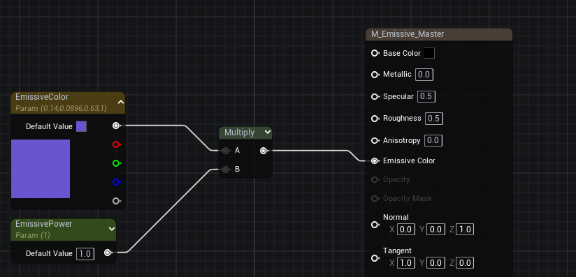
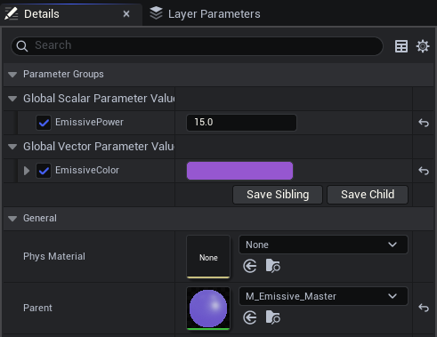
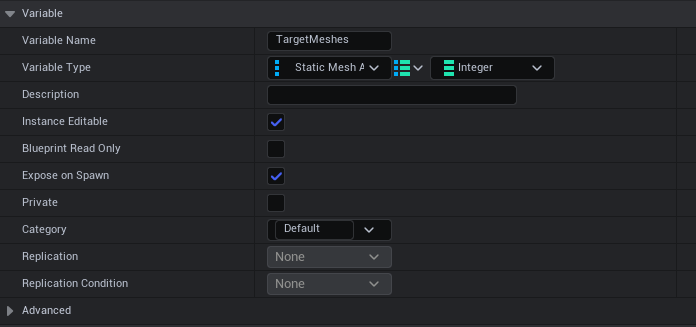
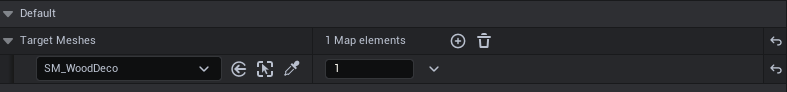
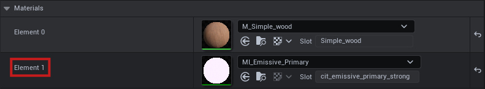
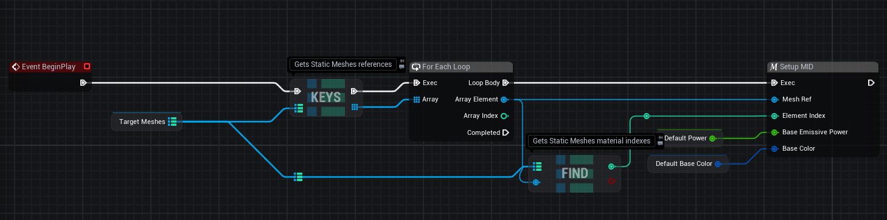
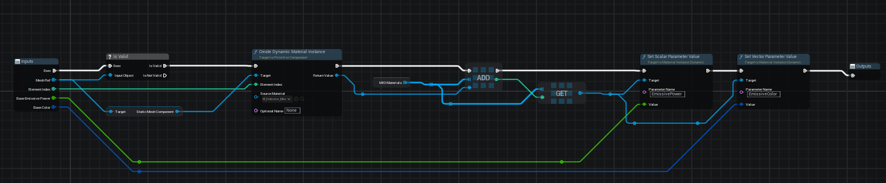
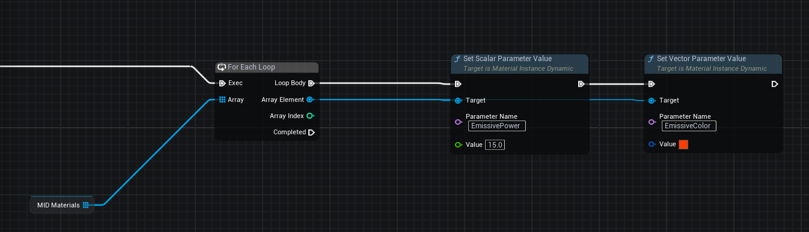

# Creating Dynamic Materials

## What are Dynamic Material Instances?

Dynamic Material Instances in Unreal Engine 5 allow you to modify material properties at runtime without recompiling the material. Unlike static material instances, dynamic instances can be created and modified during gameplay, enabling you to change parameters such as colors, textures, scalar values, and vector properties in real time.

This capability is essential for creating interactive materials that respond to gameplay events, player actions, or environmental changes. Dynamic Material Instances provide a flexible way to customize material appearance without the performance overhead of creating entirely new materials.

You can learn more about Dynamic Material Instances in the [Unreal Engine Documentation](https://dev.epicgames.com/documentation/en-us/unreal-engine/instanced-materials-in-unreal-engine?application_version=5.6#constant-and-dynamic-instances).

## Prerequisites

Before creating dynamic materials in your blueprint, you need to set up the following:

### Master Material with Parameters

Create a Master Material in the Material Editor with the parameters you want to modify at runtime. For example, for a simple emissive material:

- **Vector Parameter**: For the emissive color (e.g., `EmissiveColor`)
- **Scalar Parameter**: For the emissive intensity/power (e.g., `EmissivePower`)

These parameters should be exposed in the material so they can be modified through material instances.

### Material Instance

Create a Material Instance from your Master Material by right clicking on the Master Material and selecting "Create Material Instance". This Material Instance will be applied to the mesh that you want to have dynamic material properties.

### Apply to Mesh

Apply the **Material Instance** to the mesh component where you want to enable dynamic material modifications. The mesh must have the Material Instance assigned before you can create a dynamic material instance from it in your blueprint.

## Setting Up the Blueprint

### Create an Actor Blueprint

Create a new **Actor Blueprint** (e.g., `BP_LightsController`) that will manage your dynamic materials. Place this blueprint in your level at any location you prefer.

### Create Target Meshes Variable

Inside your blueprint, create a variable to store references to the static mesh actors that contain the material instances you want to modify.

/// tip | Best Practice
Use a **Map** with `Static Mesh Actor` as the key and `Integer` as the value. This allows you to easily manage multiple meshes with different material slot indexes. The integer value represents the material index on the mesh that you want to make dynamic.
///

### Configure Meshes in Level Editor

1. Select your blueprint actor in the level editor
2. In the Details panel, locate the **Target Meshes** variable
3. Add entries to the map for each mesh you want to control
4. For each mesh, specify:
   - The **Static Mesh Actor** reference (the mesh in your level)
   - The **Integer** value (the material slot index you want to make dynamic)

To find the correct material index for a mesh:
- Select the mesh actor in the level
- Check the **Materials** section in the Details panel
- The material index corresponds to the element number (Element 0, Element 1, etc.)

## Blueprint Logic

/// tip | Best Practice
Use **Macros** and **Functions** to organize your code and make it reusable. This approach improves code maintainability and allows you to easily apply the same logic to different scenarios in the future.
///

### Initial Setup

Create an **Event BeginPlay** node to initialize your dynamic materials when the game starts. The setup process involves:

1. **Get Target Meshes**: Retrieve the map variable containing your mesh references
2. **Extract Keys**: Use the **KEYS** node to get an array of all static mesh actors from the map
3. **Iterate Through Meshes**: Use a **For Each Loop** to process each mesh
4. **Get Material Index**: Use the **FIND** node to retrieve the material index for the current mesh from the map
5. **Setup Dynamic Material**: Call your setup macro/function for each mesh

/// tip | Default Values
You can set default values for your material parameters in the **Material Instance** properties.

- **Default Power**: A variable (Float) for the initial emissive power value
- **Default Base Color**: A variable (Linear Color or Vector) for the initial emissive color

///

### Setup MID Macro/Function

Create a **Macro** or **Function** (e.g., `Setup MID`) that handles the creation and configuration of Dynamic Material Instances. This macro should:

- **Validate Mesh**: Check if the mesh reference is valid using **Is Valid**

**Create Dynamic Material Instance**: Use **Create Dynamic Material Instance** node with:

   - **Target**: The static mesh component reference
   - **Element Index**: The material slot index from your map
   - **Source Material**: Your Material Instance (e.g., `M_Emissive_Mat`)

- **Store MID**: Add the created Dynamic Material Instance to an array variable (e.g., `MID Materials`) for later access
- **Retrieve MID**: Get the MID from the array using the element index

**Set Parameters**: Use **Set Scalar Parameter Value** and **Set Vector Parameter Value** nodes to set initial values:

   - **EmissivePower**: Set the scalar parameter for emissive intensity
   - **EmissiveColor**: Set the vector parameter for emissive color

The macro should accept inputs:

- **Mesh Ref**: Static Mesh Actor reference
- **Element Index**: Integer material slot index
- **Base Emissive Power**: Float for initial power value
- **Base Color**: Linear Color or Vector for initial color value

## Modifying Materials During Gameplay

Once you have stored all your Dynamic Material Instances in the `MID Materials` array, you can modify their parameters at any time during gameplay.

### Updating Material Parameters

To change material properties for all materials in your array:

**Iterate Through MIDs**: Use a **For Each Loop** to iterate through the `MID Materials` array  
**Set Parameters**: For each material instance in the loop, use **Set Scalar Parameter Value** and **Set Vector Parameter Value** nodes to modify:

   - **EmissivePower**: Adjust the emissive intensity
   - **EmissiveColor**: Change the emissive color

You can trigger these updates from any event in your blueprint, such as:

- Player input events
- Timer events
- Custom events
- Overlap events
- Any other gameplay logic

This approach allows you to create dynamic lighting effects, color-changing materials, or any other runtime material modifications based on your game's logic.

