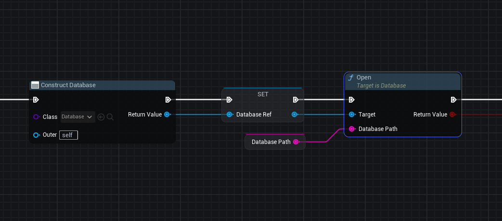
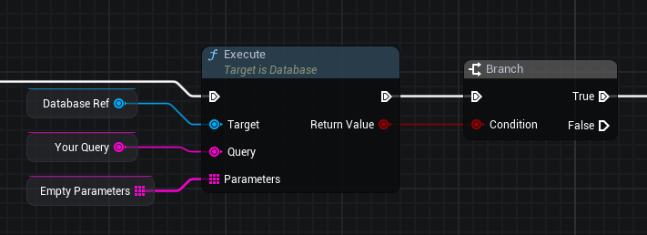
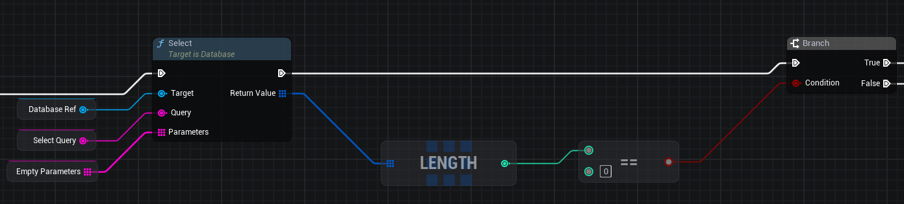
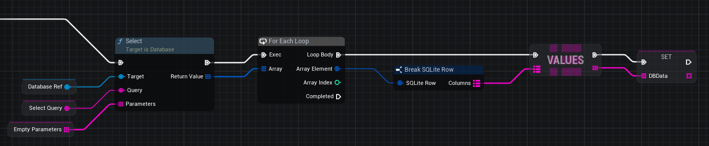
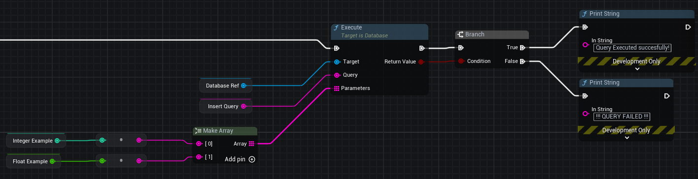

# SQLite and Blueprints

## Initializing a Database Connection

To work with persistent data, you must first create a Database instance and establish a connection.

### Step 1: Construct the Database

Use the **Construct Database** node to create a new Database instance. This node requires:

- **Class**: Select `Database` from the dropdown
- **Outer**: Set to `self` to reference the current context

The node outputs a Database reference that can be stored and used for subsequent operations.

### Step 2: Open the Database Connection

Use the **Open** node to establish a connection to your database file. This node requires:

- **Target**: Connect the Database reference from the **SET** node
- **Database Path**: Specify the path to your database file (e.g., `"path/to/database.db"`)

/// info | Note
The **Open** node automatically creates the database file if it does not exist in the specified directory. It returns `true` when the connection is successful, and `false` only if the file is locked (typically because it is open in another application).
///



## Executing Queries

Once you have an open database connection, you can execute SQL queries using the **Execute** node.

/// tip | Best Practice
Store your Database reference, queries, and query parameters in variables for easier access and better organization throughout your blueprint.
///

### Using the Execute Node

The **Execute** node requires three inputs:

- **Target**: Connect your Database reference (from the **SET** node or stored variable)
- **Query**: Connect a **Create Query** node containing your SQL statement
- **Parameters**: Connect an **Empty Parameters** node or a parameters object for prepared statements

The **Execute** node returns a boolean value indicating success (`true`) or failure (`false`). Use a **Branch** node to handle the result and execute different logic based on the outcome.

/// info | Note about Parameters
The **Parameters** input is mandatory. If you don't need to pass any parameters, you can connect an empty array of strings and pass it to the node.
///

### Example Query

```sql
-- Example query to create a table
CREATE TABLE IF NOT EXISTS table_a
(
    id         INTEGER PRIMARY KEY AUTOINCREMENT,
    column_a   TEXT    NOT NULL,
    column_b   INTEGER NOT NULL,
    column_c   TEXT    NOT NULL,
    column_d   INTEGER,
    column_e   TEXT,
    created_at TIMESTAMP DEFAULT CURRENT_TIMESTAMP
);
```



## Querying Data

To retrieve data from your database, use the **Select** node. This node works similarly to **Execute**, but returns query results instead of a boolean value.

### Using the Select Node

The **Select** node requires the same three inputs as **Execute**:

- **Target**: Connect your Database reference
- **Query**: Connect a **Create Query** node containing your SELECT statement
- **Parameters**: Connect a parameters array if your SELECT query uses parameters (e.g., for WHERE clauses), or an **Empty Parameters** (an empty array of strings) if no parameters are needed.

/// info | Checking for Results
The **Select** node returns a collection of results from your query. You can check if results exist by using the **LENGTH** node to get the count of returned rows, then compare it to zero using an equality operator (`==`) to determine if the query returned any data.
///

### Example: Checking for Results

Use a **Branch** node with the length comparison to handle cases where no results are found:

- **True** branch: Execute logic when results exist (length > 0)
- **False** branch: Execute logic when no results are found (length == 0)

### Example Queries

```sql
-- Example query to select specific columns from a table
SELECT column_a,column_b,column_c,column_d,column_e FROM table_a;

-- Example query to select all columns from a table
SELECT * FROM table_a;
```



## Handling Query Results

When you execute a **Select** query, the node returns an array of SQLite Row objects. To access the data within each row, you need to iterate through the results and break down each row into its column values.

### Iterating Through Results

Use a **For Each Loop** node to iterate through the array of rows returned by the **Select** node:

- **Array**: Connect the **Return Value** output from the **Select** node
- **Array Element**: Each iteration provides a single SQLite Row object
- **Loop Body**: Execute logic for each row
- **Completed**: Execute logic after all rows have been processed

### Breaking Down SQLite Rows

Use the **Break SQLite Row** node to extract column data from each row. This node takes a SQLite Row object and outputs a map structure:

- **SQLite Row**: Connect the **Array Element** from the **For Each Loop**
- **Columns**: Outputs a map containing the row data

The **Columns** output is a map composed of:

- **Keys**: An array containing the column names from your query
- **Values**: An array containing the corresponding values for each column

You can access individual column values using the **VALUES** node or by accessing the map directly using the column names as keys.

### Example: Processing Each Row

1. Execute a **Select** query to get an array of rows
2. Use **For Each Loop** to iterate through each row
3. Use **Break SQLite Row** to extract the column data from the current row
4. Access the **Columns** map to get Keys (column names) and Values (column data)
5. Process or store the data as needed



## Inserting Data

To insert data into your database, use the **Execute** node with an INSERT statement and parameters. Parameters allow you to safely pass values into your query using prepared statements.

### Using Parameters with INSERT

When inserting data, use placeholders in your SQL query (`?` for SQLite) and pass the actual values through the **Parameters** input using a **Make Array** node.

The **Execute** node requires:

- **Target**: Connect your Database reference
- **Query**: Connect a **Create Query** node containing your INSERT statement with placeholders
- **Parameters**: Connect a **Make Array** node containing the values to insert, in the same order as the placeholders in your query

/// tip | Best Practice
The **Execute** node returns a `boolean` value indicating **success** or **failure**. Use a **Branch** node to handle the result and provide appropriate feedback or error handling.
///
### Example INSERT Query

```sql
-- Example INSERT query with parameters
INSERT INTO table_a (column_a, column_b)
VALUES (?, ?);
```

In this example, the two `?` placeholders correspond to the two values you pass through the **Parameters** array. The values are inserted in the order they appear in the array.


