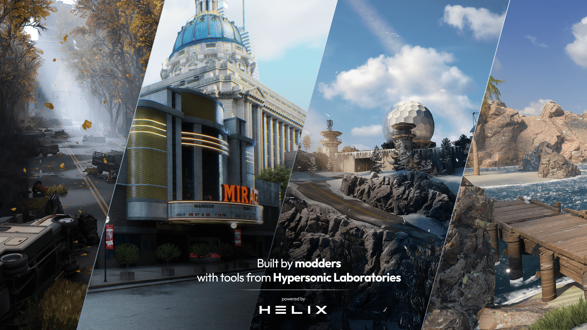

# Introduction

Welcome to the official documentation for [HELIX](https://helixgame.com/){.external}, the ultimate open-world multiplayer sandbox platform.

## About HELIX

HELIX is an open-world multiplayer sandbox platform, specifically designed for roleplay. As a developer, you can create your own games, roleplaying servers, and virtual worlds using our extensive scripting API and creation tools.

- :fontawesome-solid-people-line: **Built By Creators, For Creators**{.whiter} - We built HELIX from the ground up to be as easy to develop on as it is to play on. Leverage the full power of our scripting API, extensive library of packages, and creation tools to import any type of custom asset and create any type of multiplayer experiene you can imagine.

- :material-chart-areaspline: **Full IP Ownership**{.whiter} - Modders are always at the risk of being shut down as they're building on top of another game's IP. With HELIX, you retain full IP ownership of any original work that you create and publish on the platform.

- :material-arrow-up-box: **Community-First Development**{.whiter} - We're building HELIX alongside our community. We deeply value your feedback and directly incorporate community-requested features into the product. If you have any suggestions about the gameplay or development experience, don't hesitate to reach out on our Discord.

<!-- 1.  The Add-on Vault is a central repository of shared assets that contains
    everything you need to build your worlds and RP servers. Discover thousands of add-ons and mods from maps, characters, vehicles, weapons, Lua scripts to entire game modes!

 , and mututally-beneficial monetization! (2) 
2.  Simply put, Hypersonic takes a cut of all the profits on HELIX. This means
    the success of the company is directly in-line with how successful you, the creators, are. In other words, our goals are mutually aligned! :partying_face: -->

## Getting Started

-   __Quickstart__

    The best way to learn is by doing. Make your first game quickly and easily in this step-by-step tutorial!

    <!-- [:material-folder-download-outline: Install](install.md) -->

    [:material-controller-classic-outline: Create Your First World](../tutorials/create_helix_world.md)

-   __Disciple specific tooling__

	Whatever you specialize in, we've got the right tools for you. 

    [:octicons-command-palette-16: Scripters](../scripting/packageguide.md)

    <!-- [:octicons-server-16: RP Server Owners](rpServerOwners.md) -->

    [:material-palette-outline: Artists](../tutorials/creatorkit.md#-create-a-new-package)
    
-   __View tutorials and examples__

    See how it's done directly, either step-by-step or through examples.

    <!-- [:material-file-document-check-outline: General Tutorials](../tutorials/create_helix_world.md) -->

    [:material-file-document-arrow-right-outline: Scripting Tutorials](../scripting/index.md)

-   __Browse the API__

    Check out our extensive API to see the full breadth of HELIX.

    [:octicons-file-code-24: View API](../api/index.md)

/// tip |  Navigation
Use ++right++ to quickly go to the next page too!
///

### Contributing
HELIX's documentation is continuously written and edited, and **we'd love your help/input to make it better!** To contribute, simply click the <a href="#" title="Edit this page" class="md-icon">edit icon :material-file-document-edit-outline:</a> in the **top right corner of any page**.
