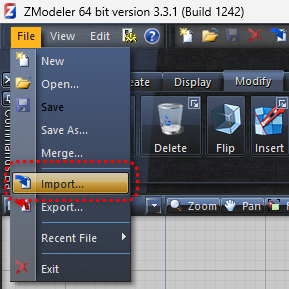

# Convert FiveM Assets to HELIX

This guide explains how to convert your **FiveM assets** — such as shells, interiors, and props — into **HELIX-compatible assets** that can be imported into Unreal Engine and uploaded to the **HELIX Vault**.

You’ll use **ZModeler3** (or a similar converter) to export your meshes, a 3D app like **Blender**, **Maya**, or **3ds Max** to clean them up, and **Unreal Engine** to finalize materials and prepare them for packaging.

> ⚠️ **Important:**
> 
> 
> This tutorial is for **FiveM creators converting their own original work**.
> 
> Do **not** port copyrighted GTA V assets or any content you don’t own.
> 

---

## 🧰 **1️⃣ Prerequisites**

If you’ve already created models for **FiveM**, you likely have everything you need:

- **Blender**, **Maya**, or **3ds Max** — your existing modeling tool
- (Optional) **ZModeler 3** — only needed if you originally built or exported vehicles in FiveM using `.ydr` or `.yft` formats
- If that’s your case, follow Steps 2–3 to export FBX + textures, then continue at Step 4.
- Everyone else can skip straight to **Step 4**.

---

## 🧱 **2️⃣ Export the Mesh (FiveM → FBX)**

1. Open **ZModeler3** and import your model (e.g., `.ydr` or `.yft`).

1. In the **Scene Nodes Browser**, expand **Structure** and enable **L0** to show the mesh.

1. Delete unnecessary nodes:
    - Remove **lights**, **COL** (collision) objects, and **extra LODs**
    - You’ll rebuild collision later in your 3D app or Unreal
        
        
        
2. Export as **FBX** → `File > Export > FBX`
    - Keep the default **up-axis** unless your 3D app uses a different one
    
    
    

---

## 🎨 **3️⃣ Export Textures**

1. In **ZModeler**, open **Texture Browser**

1. Select all textures → **Save** → choose **DDS format**

1. Convert `.dds` textures to `.png` using a free converter such as
👉 [EzyZip DDS → PNG](https://www.ezyzip.com/convert-dds-to-png-online.html)

---

## 🧩 **4️⃣ Relink Textures in Your 3D App**

1. Import the exported `.fbx` into **Blender**, **Maya**, or **3ds Max**
2. Check each material slot — they may still point to `.dds` textures

1. Replace every `.dds` reference with the corresponding `.png` texture

1. Save or re-export your updated `.fbx`

If the above texture replacement method doesn't work for you, another way to find the correct texture file for each material is in Zmodeler's Material Browser option, double-click on each material to show its textures.

In this case, you will need to add the **PNG** texture in the corresponding material created when you import the mesh on Unreal Engine

---

## 🧱 **5️⃣ Create or Rebuild Collision**

- **Small props:** Unreal can automatically generate convex collision
- **Shells or interiors:** build custom **UCX_** collision meshes in your 3D app

📺 Reference: [Unreal Custom Collision Tutorial](https://www.youtube.com/watch?v=8nEfzq3Wb5g&t=342s)

Keep collision geometry low-poly for best performance.

---

## 🧰 **6️⃣ Import into Unreal Engine**

1. Export your cleaned asset again as **FBX**
2. In Unreal Engine 5:
    - Import the `.fbx` into your project
    - Verify **scale** looks correct
3. Unreal will auto-create materials — convert them into **Material Instances** for easy tuning

📺 Guide: [Creating Material Instances in Unreal](https://www.youtube.com/watch?v=FzFtht_kMCc)

---

## 🚀 **7️⃣ Verify and Package for HELIX**

Before packaging with the **HELIX Creator Kit**, confirm:

- ✅ Textures appear correctly
- ✅ Collision behaves properly
- ✅ Scale and pivot alignment look right

Then use the **Creator Kit** to generate a `.pak` and upload it to the **HELIX Vault**.  To download and use the HELIX Creator Kit, please see [this tutorial](../creatorkit.md).

---

## ✅ **Summary**

| Step | Action | Tool |
| --- | --- | --- |
| 1 | Import & clean your FiveM model | ZModeler 3 |
| 2 | Export `.fbx` mesh | ZModeler 3 |
| 3 | Save & convert textures (`.dds → .png`) | ZModeler 3 / EzyZip |
| 4 | Relink textures + add collision | Blender / Maya / 3ds Max |
| 5 | Import & optimize | Unreal Engine |
| 6 | Package & upload | HELIX Creator Kit |

---

## 💡 **Best Practices**

- Keep texture resolution ≤ 4 K for performance
- Use proper **PBR** maps (Base Color, Normal, Roughness, Metallic)
- Combine smaller props into modular kits
- Always test in a **HELIX World** before publishing

---

🎉 You’re all set!

Your FiveM-created asset is now HELIX-ready — optimized, collision-safe, and ready to share with the community via the HELIX Vault.
