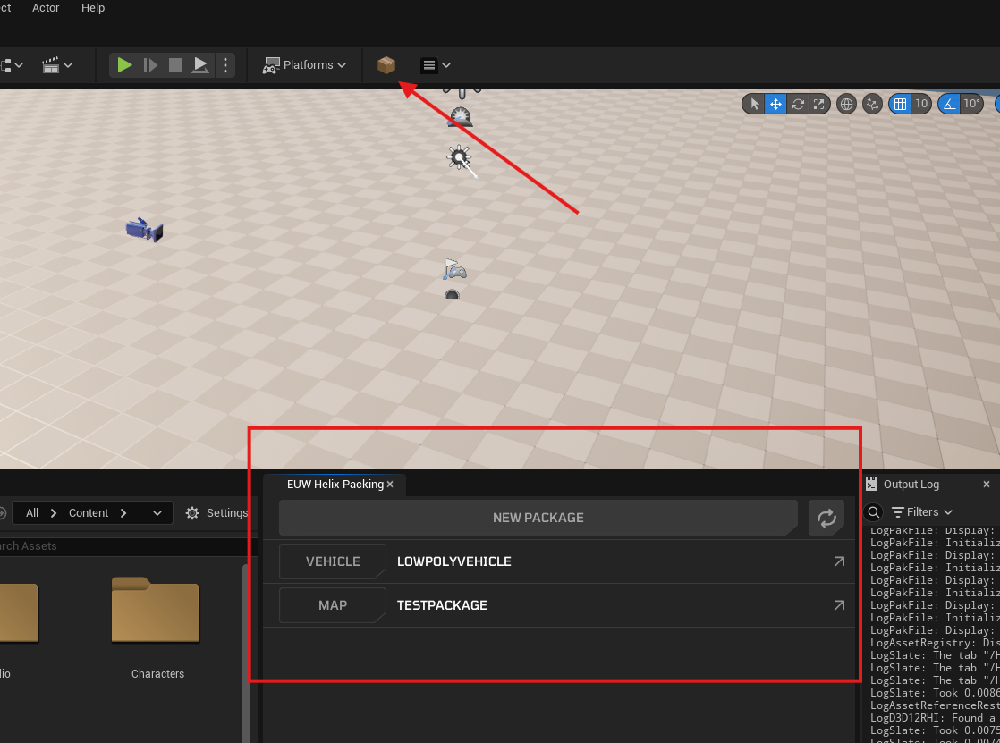
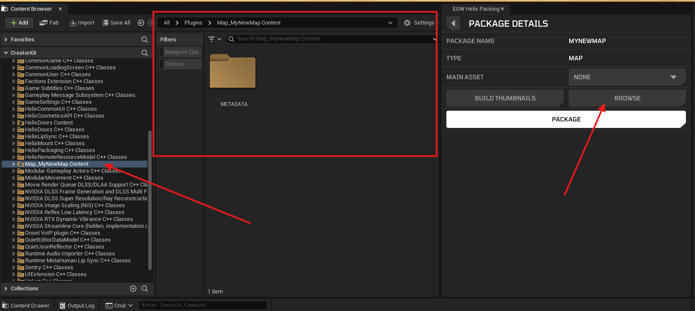

# Install Creator Kit

The **Creator Kit** is an Unreal Engine plugin released by HELIX to package custom assets to be imported into HELIX worlds. Some very basic knowledge of the Unreal Engine 5 Editor is recommended before using Creator Kit. There are plenty of high-quality tutorials online covering the basics of UE5, such as this [Unreal in 100 Seconds](https://www.youtube.com/watch?v=DXDe-2BC4cE) video.

---

# Install Unreal Engine & Creator Kit plugin

Creator Kit requires a copy of UE5.5 to function. You can install both for free.

1. Install **Unreal Engine 5.5** from [Epic Games Launcher](https://www.unrealengine.com/en-US/download)

   - IMPORTANT: Make sure to select **5.5.x** from the dropdown list. Creator Kit **will NOT work** if you install an older or newer version of UE5 (i.e. UE5.7.0)
   - [screenshot of 5.5 selection in Launcher, emphasize 5.5 version]

<!-- Added only one link since this will go live once the new version is out. -->
3. **Download Creator Kit:** [Download link](https://drive.google.com/file/d/1onlmJIxxfWQRoIRWURGTyRhJLzRW7m4R/view). 

4. Open CreatorKit.uproject using UE5.5.

---

# 📦 Create a New Package

Creator Kit can be used to package any Unreal asset for use in HELIX. This includes (but not limited to) the following asset types. Follow the linked tutorials below to import and use your desired asset type.

   - [Maps](custom_maps.md)
   - [Animations](custom_animations.md)
   - [Characters](custom_characters.md)
   - [Vehicles](custom_vehicles.md)
   - [UI](custom_ui.md)
   - VFX
   - Props (static meshes, skeletal meshes, etc)
   - ..and any type of Unreal asset (more tutorials will be added soon)

Use the HELIX Packing Tool from the main toolbar to create and manage packages.

   

---

# Important Tips

## Ensure ALL Referenced Assets Are Inside The Package Folder

When you create a new package using Creator Kit, it will create a new **plugin** with the selected package type and name (i.e. "Addon_MyFirstPackage").

Ensure that every asset is contained within this folder. You can always navigate to this folder from the Packing Tool.

You can migrate content from other projects, directly into the plugin content folder.

## Package Types

A single HELIX package can contain several assets of the same or different asset type (i.e. An "Addon" type package can contain blueprints, static meshes, materials, effects). However, if you select a specific package type upon creation such as Vehicle or Map, Creator Kit will only cook/package assets that are directly referenced by the selected "default asset". This may result in some of assets that are present in the Content Browser package folder to be missing from the packaged Pak file. 

Recommendation: Select the "Addon" package type if you want every asset in the Content Browser package folder to be included in the packaged Pak file.

