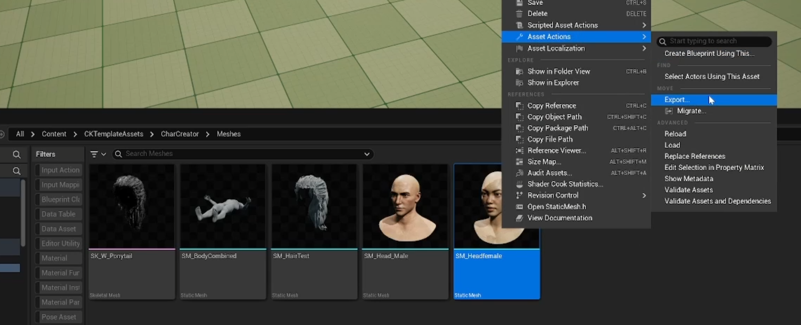
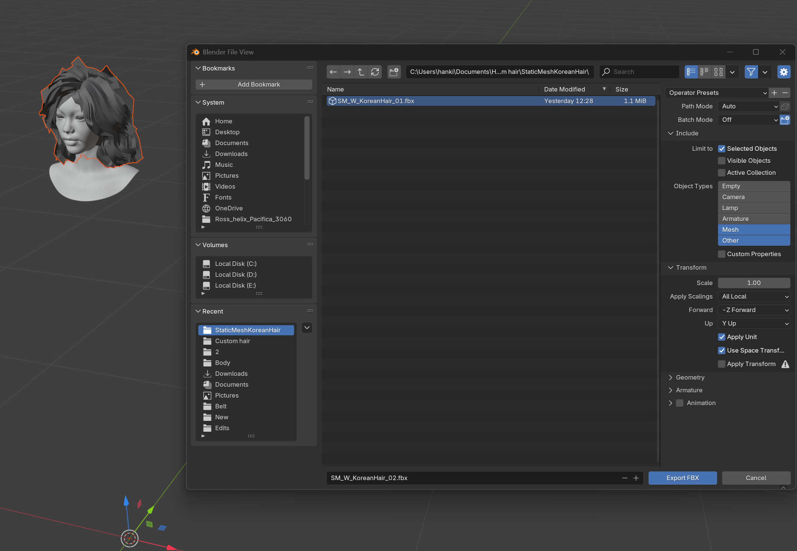
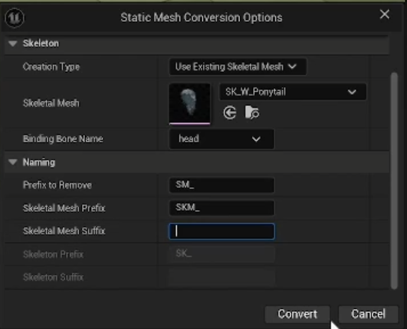
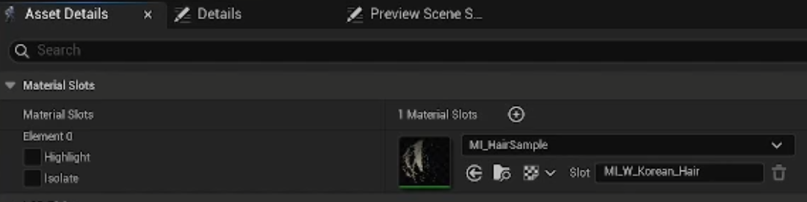
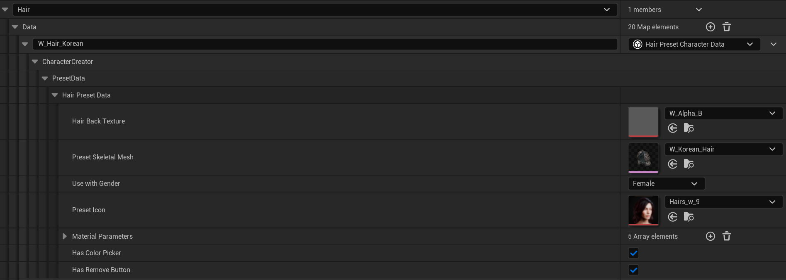
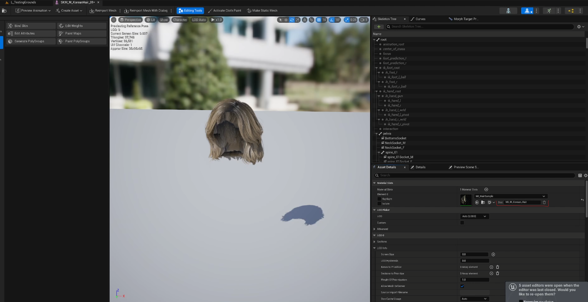
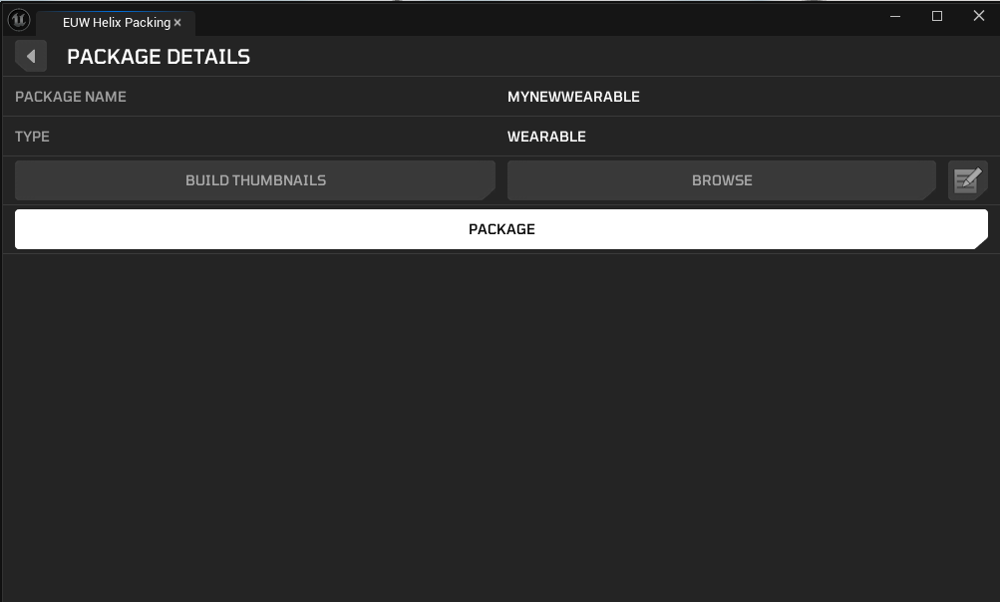
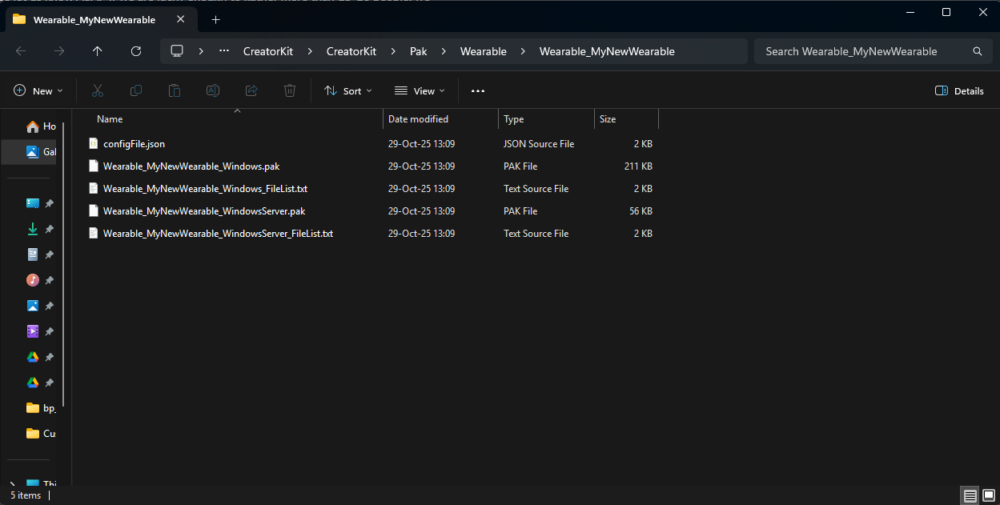
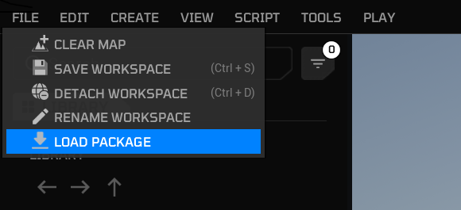
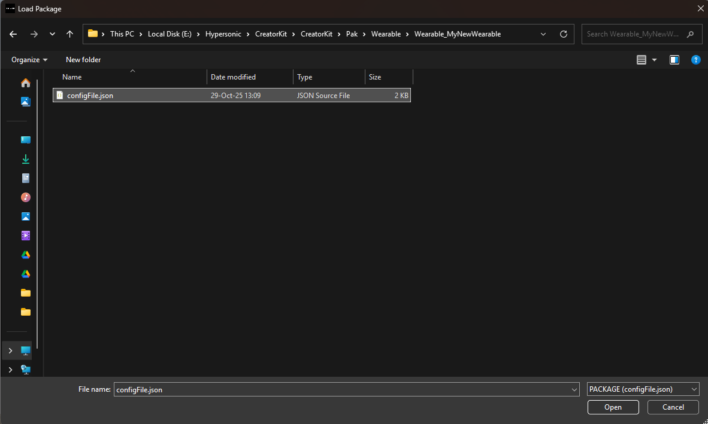

# Custom Hair

This guide walks you through the process of creating and packaging Custom Hair for the [Creator Hub](https://github.com/Hyper-Ross/helix-documentation/blob/Ross_CC_Tattoos/docs/tutorials/creatorhub.md) using the [Creator Kit](https://github.com/Hyper-Ross/helix-documentation/blob/Ross_CC_Tattoos/docs/tutorials/creatorkit.md).

**1. Acquire Your Required Template Resources**

Notice We have supplied Template assets inside of Creator Kit to make custom asset development easier. This can currently be found in **Content/CKTemplateAssets**

For this tutorial we will need **SM_Headfemale** or **SM_Head_Male** to guide your hair creating and positioning.

1. Launch the **Creator Kit** editor.
2. Navigate to **CKTemplateAssets** in the Content Browser.
3. Search for **SM_Headfemale / SM_Head_Male**  or look in the appropriate folders (e.g. **CKTemplateAssets/Meshes**).
4. Right Click the asset and select **Asset Action > Export**.
    
    
    

Note: If you’re creating hair for a male, export the male head, if you’re creating hair for a female, export the female head. If the hair you want to create is unisex you’ll have to create two separate variants of the hair where it’s aligned to each head of the corresponding gender

---

**2. Hair Creation**

After acquiring the template asset we need to put them to use into an 3d modelling package such as **3DS Max**, **Maya**, **zBrush** or **Blender**. I recommend Blender as a free, accessible option

1. Launch your modelling package **e.g. Blender**.
2. Import the head template asset.
3. Create your hair on top of the head. (Skip to step 6 if you’re importing an existing hair mesh)
4. Convert your hair to hair cards if you haven't already. 
5. Export your hair alpha texture.
6. Make any final placement adjustment to the hair mesh
7. Paint your mesh weights if and where appropriate. 
8. Select and export your hair mesh as a `.fbx` using the **SM_** naming prefix (Excluded the head and any other scene elements from the export)

    

---

**3. Creator Kit Package setup**

1. Launch the **Creator Kit** editor.

2. Access the **HELIX Packaging Tool** from the main toolbar.

3. In the packaging tool window, click **New Package**.

4. Enter a unique Package Name (e.g. MyHairSet01).

5. Select **Wearable** as the **Package Type**.
    
    
    
6. Click **Add New Package**. This action creates a dedicated plugin folder for your assets (e.g., **Plugins/Wearable_MyHairSet01**).
    
    
    

7. Go into the folder you've created and click the **Import** button in content browser. Choose your `.fbx` model file. (You can also drag it into the Content Browser from Windows File Explorer)
8. Do the same import procedure for all your texture e.g. **HairCardAlpha**`.png`

---

**4. Convert Static Mesh to Skeletal Mesh.**

1. Right Click the newly imported mesh and select **Convert to Skeletal Mesh**.

2. Make sure the desired path is your pack content folder (e.g. **/Wearable_MyHairSet01**).

3. Set creation Type to **Use Existing Skeletal Mesh.**

4. In the Skeletal Mesh box assign the Skeletal mesh hair example from Content/CKTemplateAssets.

5. Set **Binding Bone Name** to head.

6. Set **Prefix to Remove** to **SM_.**

7. Set **Skeletal Mesh Prefix** to **SKM_.**

8. Press **Convert.**

    

1. Save the newly created skeletal mesh
2. Delete the originally imported Static Mesh from the project

---

**5. Material Setup**

1. Find **MI_HairSample** from the **Content/CKTemplateAssets** folder.

2. Copy **MI_HairSample** to your package folder (**e.g. Plugins/Wearable_MyHairSet01**).

3. Under Global Texture Parameters, Tick Alpha and replace the texture with your hair cards alpha texture. 

4. Then do the same for **Depth**, **DyeMask**, **Roots** and any other textures you have for application.
    1. If you don’t have any of the other textures that are active or you have more textures that the material supports you can toggle them from **GlobalStaticSwitchParameterValues** and assign your mask texture to the remaining unused slots. 

5. Now you can edit the default hair colours under **Global Vector Parameters** or adjust the roots under **Root Control**.

6. Then open your Hair Skeletal Mesh and apply your material to it.

    

---

**6. Data Asset Initial Setup**

1. In your created package folder, right click and search **Data Asset**.

2. Select **Data Asset** and set **Character Customization Data Asset** as the class

3. Rename your new data asset (e.g. **MyAnimeHairCollection01**)

4. Open your new Data Asset.

5. Press (**+**) to add a new wearable type.

6. Change **Full Character Presets** to the type of wearable you want to add (e.g. **Hair**)

7. Expand this new array element and press (**+**) next to **Data** to add a new wearable of the above mentioned type.

8. Rename your new wearable appropriately (e.g. **F_AnimeHair_01** - F denoting Female)

---

**7. Hair Data Setup**

1. Set **Hair Back Texture** to your created hairline mask based on the face uvs (Optional)

2. Set **Preset Skeletal Mesh** to your Hair SKM.

3. Select the Gender of the head you used for your hair (e.g. Female - Note: Hair is not compatible with All. A separate SKM is needed for each gender)

4. Set a Pre-set Icon if you have one (Please create and assign a 512x512 // 256x256 icon before uploading to Vault)

5. We’d recommend enabling both “Has Color Picker” and “Has Remove Button”

    

1. Under Material Parameters see ***HERE***  for options
    
    ### Material Parameters (Optional but preferred)
    
    `Type: Color
    Selected part name: Tint
    Material Slot Name: -INPUT MATERIAL SLOT NAME FROM YOUR SKM-
    Parameter Name: Tint
    Display Parameter name: Tint
    Color Value: -SET YOUR DEFAULT-`
    
    `Type: Float
     Selected part name: None
     Material Slot Name: -INPUT MATERIAL SLOT NAME FROM YOUR SKM-
     Parameter Name: Depth Cut
     Display Parameter name: Depth Cut
     Used with perameter: None
     Value: -SET YOUR DEFAULT e.g. 1-
     Min: 0.02
     Max: 1`
    
    `Type: Float
     Selected part name: Tint
     Material Slot Name: -INPUT MATERIAL SLOT NAME FROM YOUR SKM-
     Parameter Name: Tint Fill
     Display Parameter name: Tint Fill
     Used with perameter: Color
     Value: -SET YOUR DEFAULT e.g. 1-
     Min: 0
     Max: 1`
    
    `Type: Color
    Selected part name: Dye Color
    Material Slot Name: -INPUT MATERIAL SLOT NAME FROM YOUR SKM-
    Parameter Name: DyeColor
    Display Parameter name: Dye Color
    Color Value: -SET YOUR DEFAULT-`
    
    `Type: Color
    Selected part name: Root Color
    Material Slot Name: -INPUT MATERIAL SLOT NAME FROM YOUR SKM-
    Parameter Name: RootColor
    Display Parameter name: Root Color
    Color Value: -SET YOUR DEFAULT-`
    
2. To find your material slot name, navigate to you hair Skeletal Mesh and under Material Slots and the Material Element you want to affect you’ll see your slot name. You can edit this to your liking but make sure you match your slot name in the Data Asset Material Parameters with it.
    
    
    

---

**8. Packing**

1. Return to the HELIX Packaging Tool window.
2. With your package selected, click the **Package** button. This process will cook your assets into the final `.pak` file format required by the HELIX Creator Hub. This may take some time.
    
    
    
3. Once cooking is complete, a file explorer window will automatically open, displaying your final `.pak` files. Your wearable is now ready to be uploaded to the **Creator Hub**!
    
    
    
    ---
    

**9. Testing your Wearable**

**1. In Creator Kit**

1. This method doesn't require you to cook the package on the previous steps. As long as you placed all the required assets in your package folder in Creator Kit, and created the data asset as explained, it automatically becomes available for editor playthroughs.

2. Press play in the **Creator Kit** editor, and press the **P** key to show the **Character Customization UI** for your character.

3. In the shown UI, you should be able to navigate to your new wearable and click on it to test it on the character. (e.g. Face > Hair)

**2. In HELIX**

1. Create a draft world and import the `.pak` file you've cooked in **Creator Kit**.
    
    
    
    
    
2. If import was successful, you should see your assets in the left panel.

3. Importing also makes your wearables automatically available in **Character Customization UI**. Go back to the game from build mode, and the press **P** key.

4. Your imported wearable should be available in the corresponding category.

---

**10. Ready To Rock**

Once you've followed these steps, uploaded your package to Creator Hub, and imported it into your world, your new wearable items will be available for players joining your public world!
