# Body Tattoos

This guide walks you through the process of creating and packaging body tattoos for the Creator Hub using the Creator Kit.

    <iframe src="https://www.youtube.com/embed/rl3MCrs3crc?si=7Bd4tTuwfvpBV8bN" style="position: absolute; top: 0; left: 0; width: 100%; height: 100%;" frameborder="0" allowfullscreen> </iframe>

# 1. Acquire Your Required Template Resources

Within the creator kit project you will find a folder called CKTemplateAssets.

This folder contains template assets that may be required or helpful in the creation of your own assets.

For this tutorial we will need SM_BodyCombined.fbx which will act as a model template for 3d painting and T_BodyTextureTemplate to provide more contextual visualisation or visual aid for 2d texture painting

To acquire these assets:

1. Launch the Creator Kit Editor

2. Navigate to CKTemplate Assets

3. Search for SM_BodyCombined

4. Right Click the assets and select Asset Action > Export

5. Use the settings outlined here and hit Export

    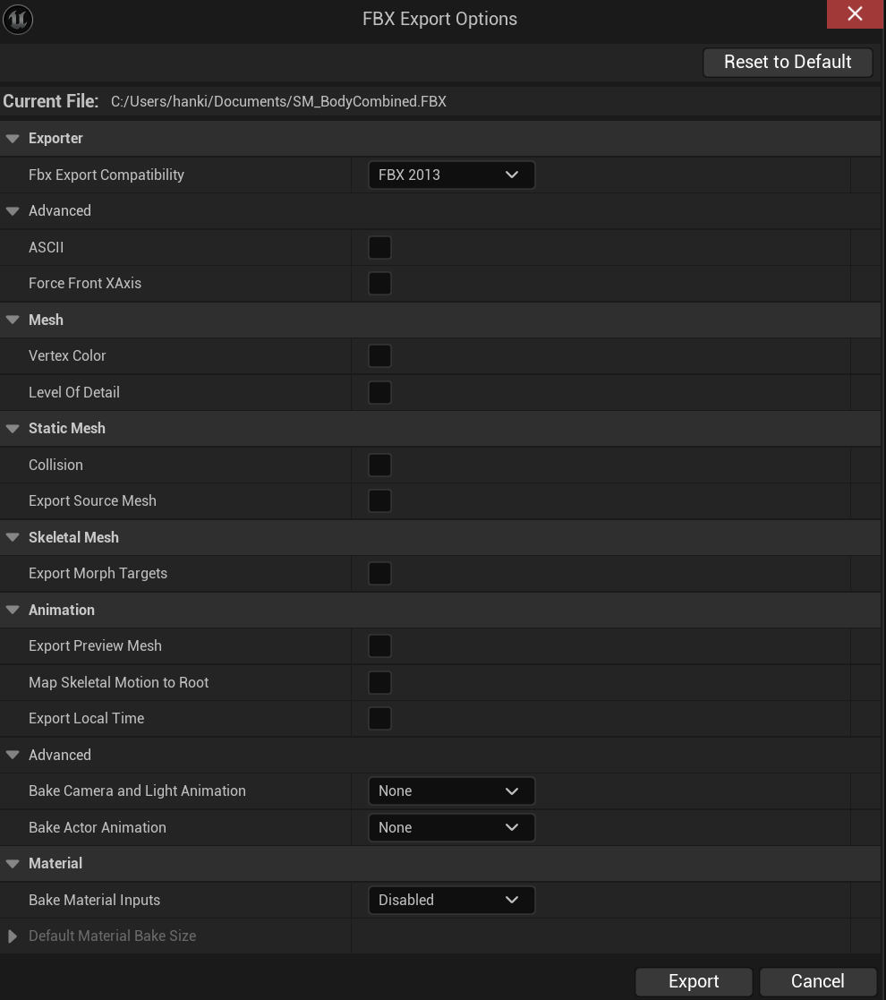

6. Now find T_BodyTextureTemplate

7. Right Click the texture and select Asset Action > Export

# 2. 3D Texture Painting Project Setup

After acquiring the template assets we need to put them to use in a texture painting application such as Quixel mixer

1. Launch Quixel Mixer

2. Create a new project (e.g. Body Tattoos)

3. Then create a new mix (e.g. Body Tattoo 01)

4. After opening your new mix navigate to the Setup Tab

5. Here change the Type to Custom Model

6. Then upload the template SM_BodyCombined.fbx to the Model slot

    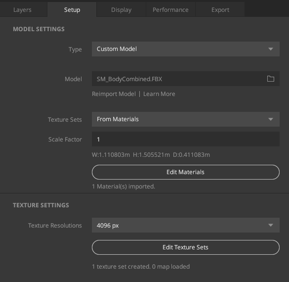

# 3. 3D Texture Painting Layer Setup

Now that you have your Quixel Mixer project setup,w e can being to setup our layers

1. Switch from the Setup tab to the Layers tab

2. Add a solid layer (denoted by the square icon)

3. Select the new layer

4. In the newly opened panel to the right, click on the arrow drop down under Albedo

5. Then press Load and Import the T_BodyTextureTemplate

6. Expand the Placement drop down and change it from Box projection to Tilling

    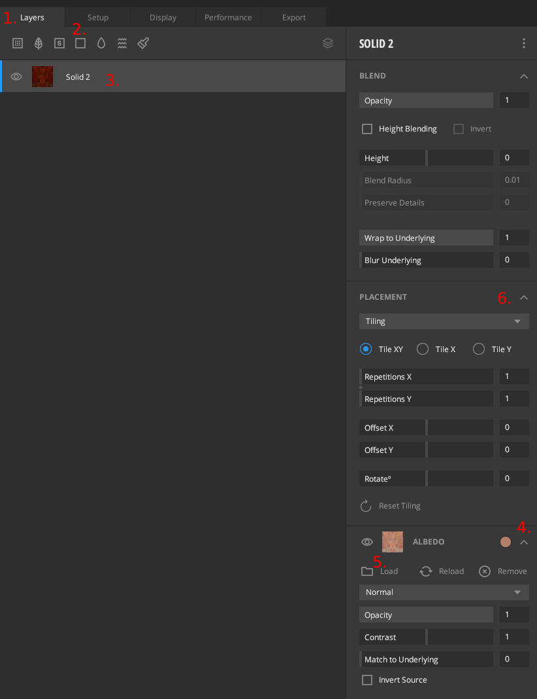

7. Now add a new solid layer above the textured layer

8. Next to Albedo click the grey circle and select the colour white

9. With the newly create white layer selected add a mask denoted by the square with the squiggle at the bottom of the layer stack

    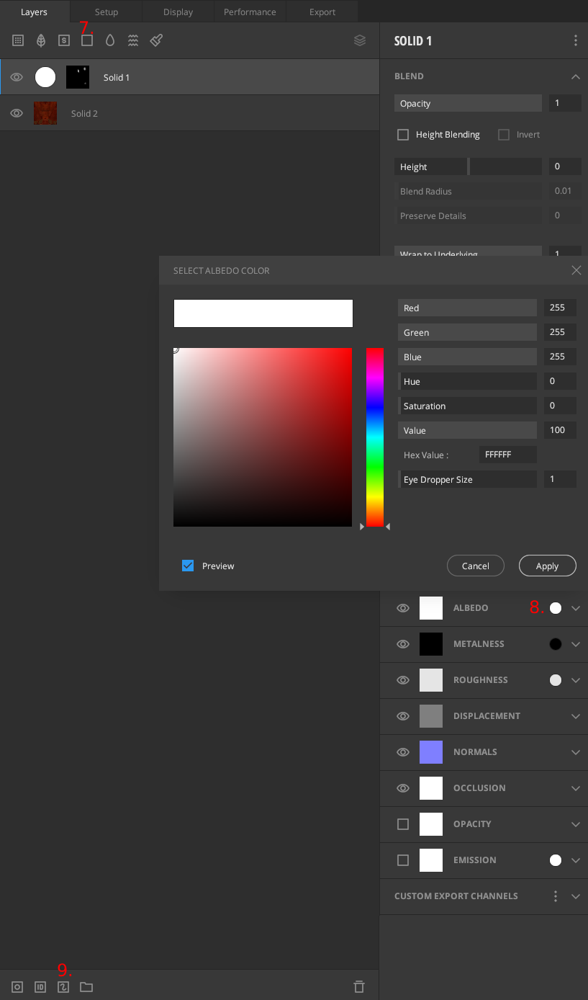

10. Then switch from 3d mode to 2d mode and paint the whole square to reveal the textured layer again

    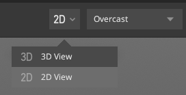

11. Switch back to 3D mode

12. Press x to invert paint colour

13. Now you can paint your designs directly on the character

# 4. 3D Texture Painting Custom Stamps

Now that you’re ready to paint, it can be a good idea to import brush alphas instead of directly painting on the mesh.

1. In the recently opened brush panel to the left of the viewport, go to brush shape

2. Click the faded circle (the current brush shape) and upload your own alpha mask

    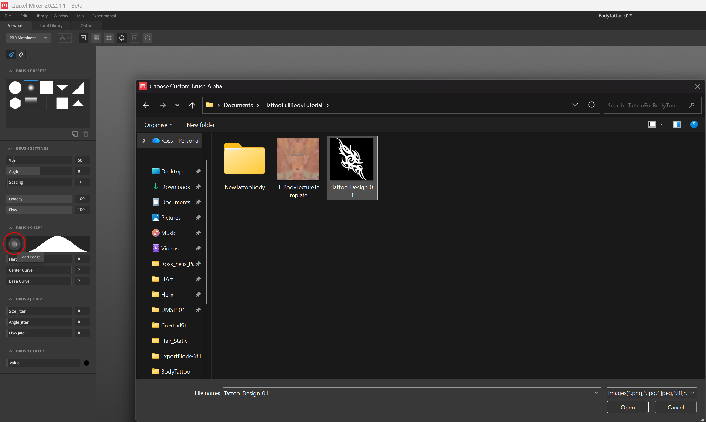

3. Then you can paint you tattoo mask wherever you’d like on the character

# 5. How to Export

1. Once you’re done, create a new fill layer (like we did earlier)

2. Make the albedo colour black

3. Place the new black layer above the character texture and below the white tattoo paint layer

    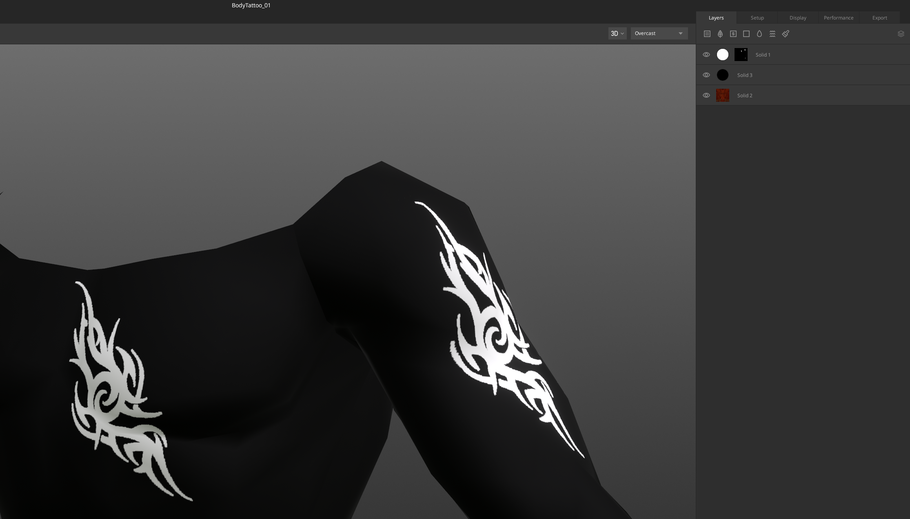

4. Now go to the export tab
    1. Set Export Target to Custom
    2. Define your export path
    3. Name your texture
    4. Untick Export Model
    5. Untick all layers other than albedo.
    6. Set your desired export resolution e.g. 4096x4096
    7. Then press export to disk.

    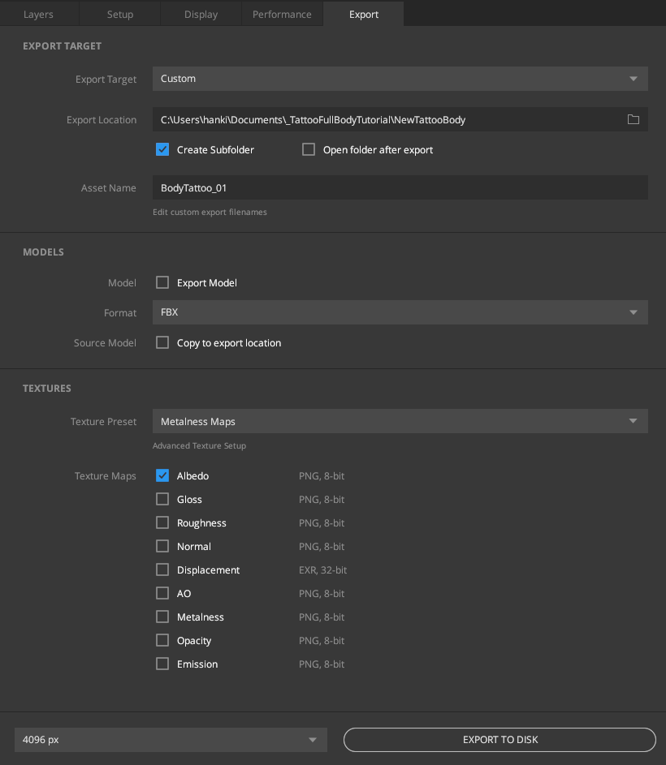

# 6. Preparing your tattoo texture

1. Import you texture into an image editing application (e.g. Photopea)

2. Select by colour > Black

3. Hit delete

4. Add colour fill to your image to define the tattoo colour

5. Save as png with transparency

# 7. Creator Kit Package setup

1. Launch the Creator Kit editor.

2. Access the HELIX Packaging Tool from the main toolbar.

    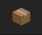

3. In the packaging tool window, click New Package.

4. Enter a unique Package Name (e.g., MyNewWearable).

5. Select Wearable as the Package Type.

    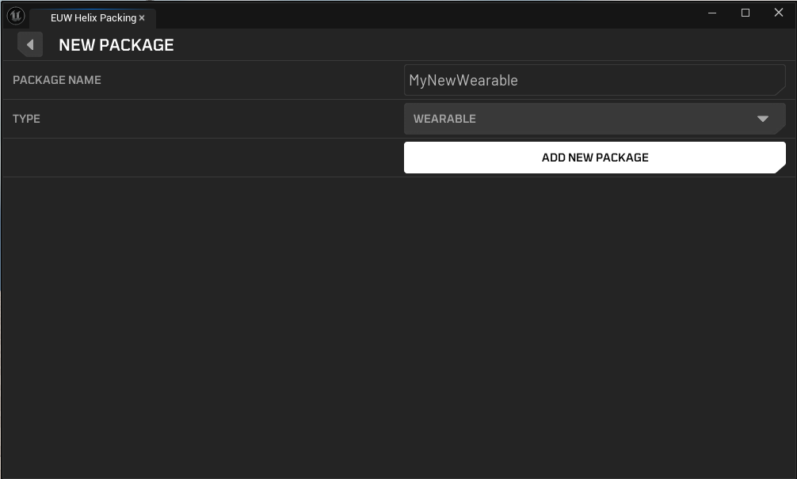

6. Click Add New Package. This action creates a dedicated plugin folder for your assets (e.g., Plugins/Wearable_MyNewWearable).

    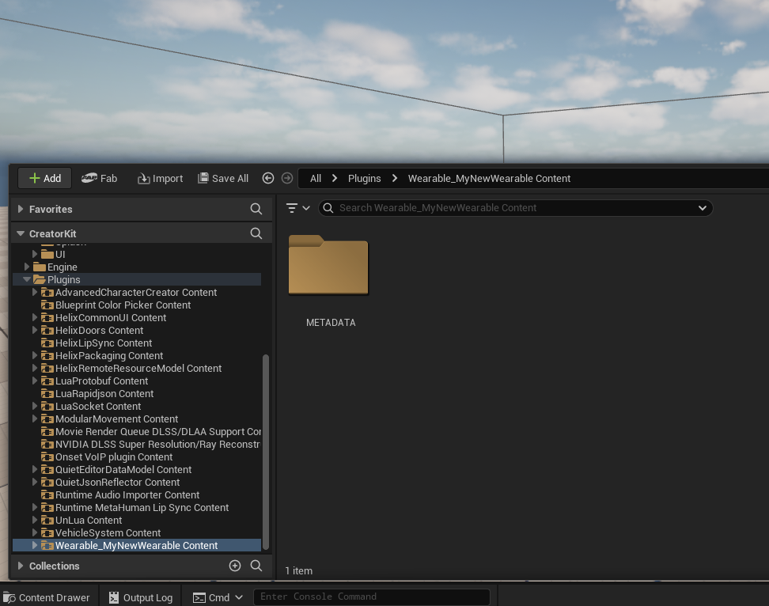

7. In the folder you've just created, click the **Import** button in Xontent Browser. Choose your texture file

# 8. Data Asset Initial Setup

1. In your created package folder, right click and search Data Asset

2. Select Data Asset and set Character Customization Data Asset as the class

3. Rename your new data asset (e.g. MyNewBodyTattoos)

4. Then open your new data asset

5. Press (+) to add a new wearable type

6. Change Full Character Presets to the type of wearable you want to add (e.g. Body tatoo)

7. Expand this new array element and press (+) next to Data to add a new wearable of the above mentioned type

8. Rename your new wearable appropriately (e.g. M_Gang1_BodyTattoo_01 - M denoting Male)

# 9. Body tattoo (Non Atlas texture) Data Setup

1. Set Atlas texture to your imported Body tattoo texture

2. For non atlas textures set Atlas Settings to (R=0,G=0,B=1,A=1)

3. Keep uv setting at  (R=0,G=0,B=0,A=0)

4. Select what Gender your tattoo is for/ compatible with (e.g. Male)

5. Set a Pre-set Icon if you have one (Please create and assign a 512x512 // 256x256 icon before uploading to Vault)

6. We’d recommend enabling both Has Color Picker and has Remove Button

7. Under Material Parameters see the attacked list for options
    1. The most important that you must set is Intensity
        1. Type: Float
        2. Selected part name: None
        3. Material Slot Name: body_skin
        4. Parameter Name: Tatoo 01 Intensity
        5. Display Parameter name: Intensity
        6. Used with perameter: None
        7. Value: 1 (This is important. This is the opacity of your tattoo)
        8. Min: 0
        9. Max: 1

8. Once you’re done, Save your data table and all assets you’ve added to you package folder

# 10. Packing

1. Return to the HELIX Packaging Tool window.

2. With your package selected, click the Package button. This process will cook your assets into the final .pak file format required by the HELIX Creator Hub. This may take some time.

3. Once cooking is complete, a file explorer window will automatically open, displaying your final .pak files. Your wearable is now ready to be uploaded to the Creator Hub!

# 11. Testing your Wearable

## 1. In Creator Kit Project

1. This method doesn't require you to cook the package on the previous steps. As long as you placed all the required assets in your package folder in Creator Kit, and created the data asset as explained, it automatically becomes available for editor playthroughs

2. Press play in Creator Kit editor, and press P button to show the Character Customization UI for your character.

3. In the shown UI, you should be able to navigate to your new wearable and click on it to test on the character. (e.g. Body > Tattoos)

## 2. In helix

1. Create a draft world and import the .pak file you've cooked in Creator Kit.

2. If import was successful, you should see your clothing asset on left panel.

3. Importing also makes your clothing automatically available in Character Customization UI. Go back to the game from build mode, and press P button.

4. Your imported wearable should be available in the corresponding category.

# 12. Ready To Rock

Once you've followed these steps, uploaded your package to Creator Hub, and imported it into your world, your new wearable items will be available for players joining your public world!
