# Custom Animations

This guide walks you through the complete process of acquiring animation packs from Fab, adapting them for the standard HELIX character rig, and packaging them as an Addon for the [Creator Hub](creatorhub.md) using the [Creator Kit](creatorkit.md).

The process for adapting animations differs depending on whether the asset pack was designed for the older Unreal Engine 4 skeleton or the modern Unreal Engine 5 rig. This guide covers both scenarios.

## 1. Acquiring & Importing Marketplace Assets

First, you need to get your animation assets from the marketplace and add them to the **Creator Kit** project.

1. Acquire your desired animation pack from [Fab](https://fab.com) (formerly the Unreal Marketplace).
2. Open the **Epic Games Launcher** and navigate to the **Unreal Engine** -> **Library** tab.
3. Locate your newly acquired pack in the **Fab Library** section and click **Add To Project**.

    

4. From the project list, select **CreatorKit**.

    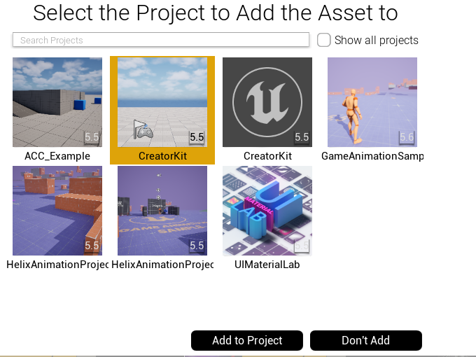

---

## 2. Setting Up Your HELIX Addon Package

Next, you will use the **HELIX Packaging Tool** to prepare your package folder.

### Option A: For UE5 Rig-Based Packs (Replace Skeleton)

This is the simpler method, used for modern packs that are already compatible with the `UE5` skeleton.

1. Launch the **Creator Kit** editor.

2. Find your imported Fab asset folder and right click to it. Select **Convert to Package (Addon)**. This will make it possible to directly cook this folder with HELIX Packaging Tool.

    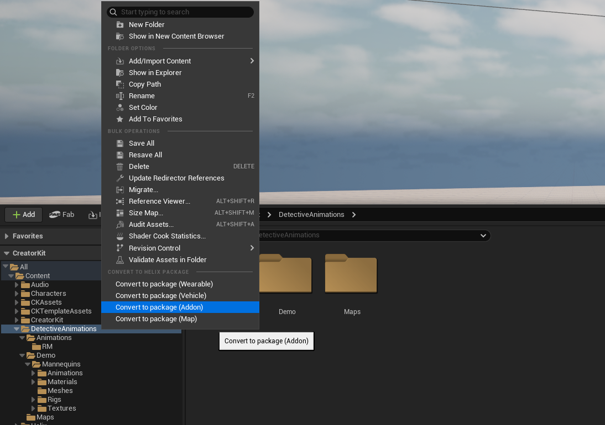

    /// info | Note
    Alternatively, you can also create a new package folder from HELIX Packaging Tool and move your assets or import source files into the created folder.
    ///

3. Select all the **Animation Sequence** assets in your package folder.

4. Right-click the selection and choose **Replace Skeleton...**

    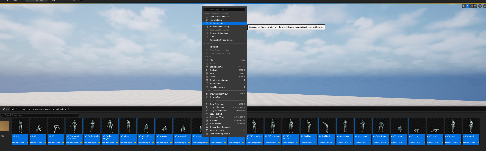

5. In the dialog, select **SK_Unified** from the list. This is the primary skeleton used by default for HELIX characters. Click **OK**.

    

6. Verify that the selected animations now reference the **SK_Unified** skeleton. Save all modified assets (`Ctrl+ShiftS`).

    

### Option B: For `UE4` or Custom Rig-Based Packs (Retarget Animation)

This method is for older packs built for the `UE4` Mannequin or packs using a custom rig. It uses the **IK Retargeting** system to create new, compatible animations.

1. Launch the **Creator Kit** editor.

2. Access the **HELIX Packaging Tool** from the main toolbar.

3. In the packaging tool window, click **New Package**.

    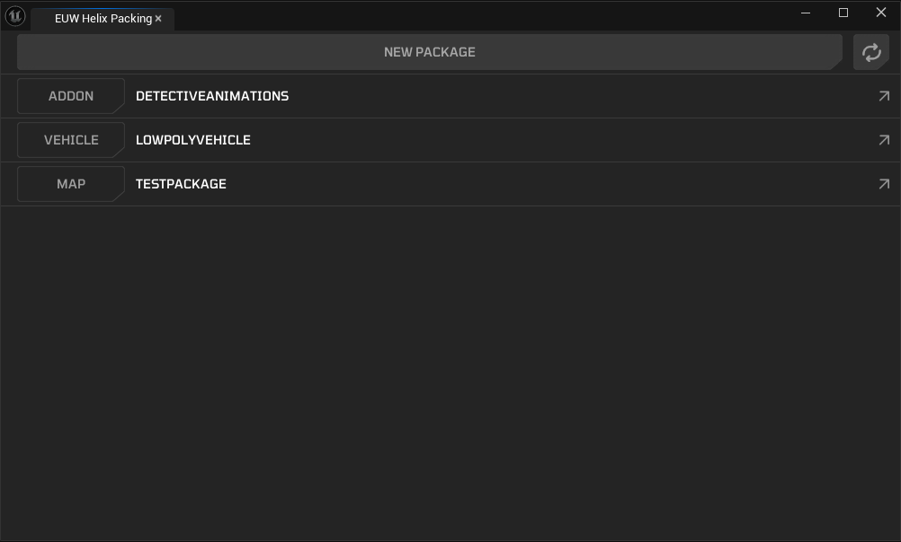

4. Enter a unique **Package Name** (e.g., `MyFirstAnimationPack`) and select **Addon** as the **Package Type**.

5. Click **Add New Package**. This action creates a dedicated folder for your assets (e.g., **Plugins/Addon_MyFirstAnimationPack**).

    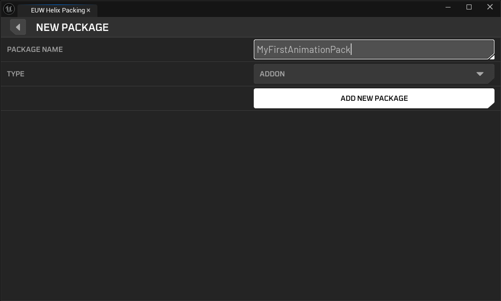

6. In the **Content Browser**, locate the main folder for the animation assets you imported in Section 1.

    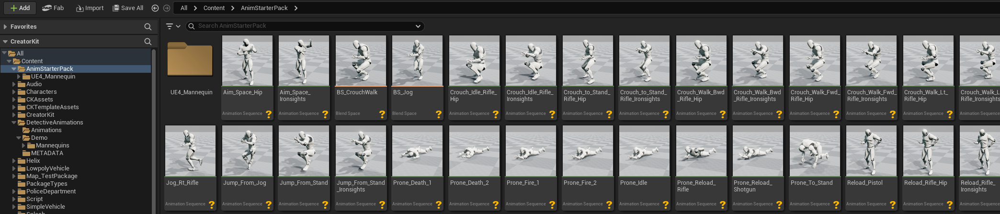


8. Select all the **Animation Sequence** assets in your package folder, right-click the selection, and choose **Retarget Animation Assets** -> **Duplicate and Retarget Animation Assets**.

    

9. The Animation Retargeting window will open. For **Source Skeleton**, select the original skeleton from the downloaded pack (e.g., **SK_Mannequin**).

    

10. For **Target Skeleton**, choose **SKM_Manny** located in **Content/Characters/Heroes/Unified** folder.

    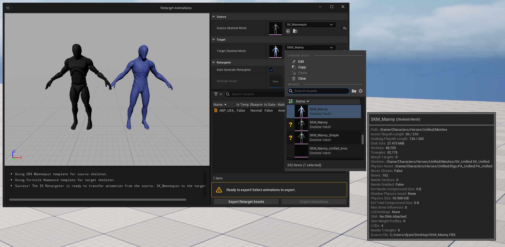

    /// info | Note
    Your project may contain multiple assets named **SKM_Manny**. Ensure you select the one from the **Unified** folder, as shown in the screenshot. This is the mesh associated with our **SK_Unified** skeleton.
    ///

11. You can typically leave **Generate Auto Retargeter** checked to automatically map bones. For advanced use cases where the automatic mapping is incorrect, you can uncheck this and provide your own custom **IK Rig** and **IK Retargeter** assets.

12. Review the list of animations to be generated. You can uncheck any you don't need. Click **Export Animations** button.

    

13. On the new window, select your helix package folder (e.g., **Plugins/Addon_MyFirstAnimationPack**) as the destination. Click **Export**.

    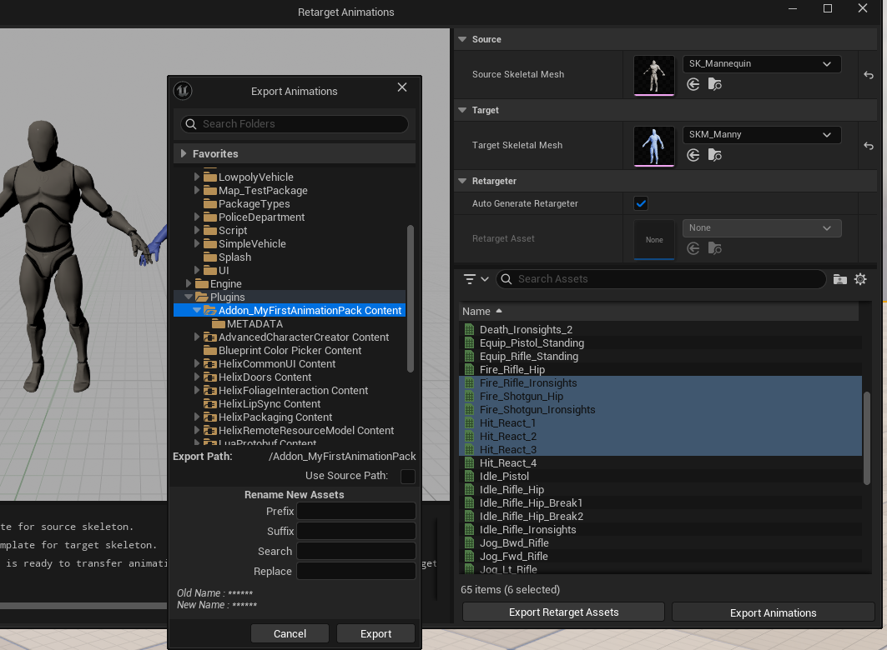

14. Click **Export** button again in next window.

    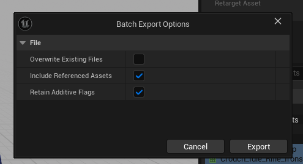

15. The engine will now process and retarget all selected animations, creating new copies in your package folder that are compatible with the HELIX skeleton.

---

## 4. Finalizing and Cooking The Package

With your animations successfully adapted and moved to your package folder, you can make final adjustments and "cook" the final `.pak` file.

1. Open the animation assets inside your package folder (e.g., **Plugins/Addon_MyFirstAnimationPack**).

2. Perform any necessary final adjustments. This is a good time to:
    - Enable/Disable **Root Motion**.
    - Add **Animation Notifies** (AnimNotifies) for events like footsteps or impacts.
    - Add or modify **Animation Curves**.
    - Adjust play rate or other settings.
  
3. If your package folder has any asset type unrelated to animations (textures, materials, levels, skeletal meshes etc.), remove them to reduce clutter.

4. Return to the **HELIX Packaging Tool** window.

5. With your package selected, click the **Package** button. This process will cook your assets into the final `.pak` file format required by the **Creator Hub**. This may take some time.

    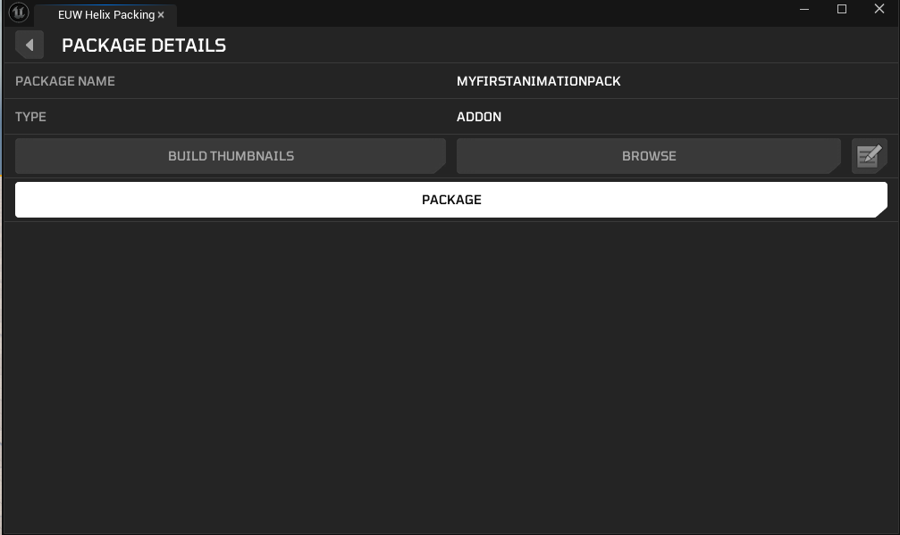

6. Once cooking is complete, a file explorer window will automatically open, displaying your final `.pak` file. Your animation pack is now ready to be uploaded to the **Creator Hub**!

    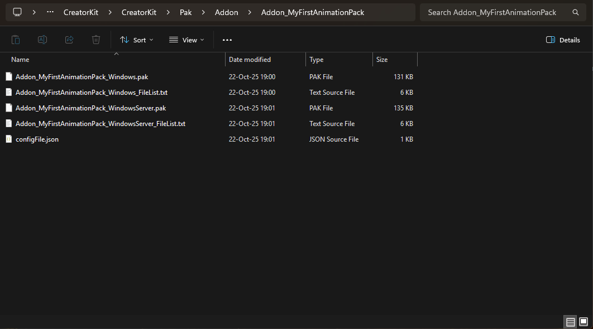

---

## 5. (Bonus) Importing Animations From Mixamo

It's also possible to download animations from [Mixamo.com](http://www.mixamo.com) and import them into Creator Kit for packaging with same retargeting steps done for `UE4` rig-based packs.

1. Find an animation you'd like to use from Mixamo and use **Y-Bot** as your character for best retargeting results.

    

2. Click **Download** button after tweaking your animation.

3. On the new window, select options as shown on the image below and click **Download** button. This will download an `.fbx` file, ready to be imported into Creator Kit.

    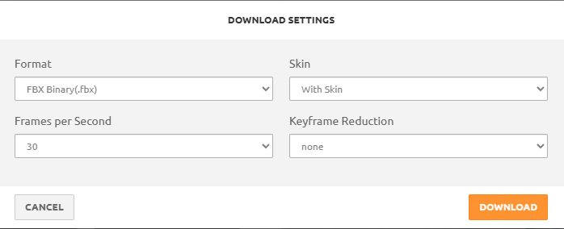

4. Create a temporary folder in Creator Kit project, and click **Import** in content browser to import your mixamo animation `.fbx` file.

    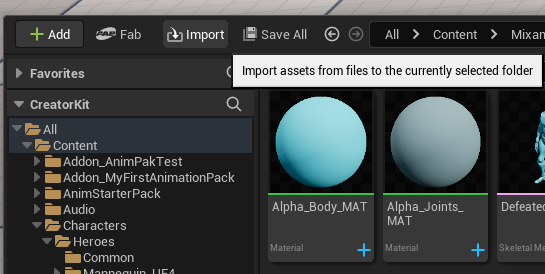

5. This will import character mesh, materials and animation sequence asset into the target folder.

    

6. Follow the same steps starting from `Option B: For UE4 Rig-Based Packs (Retarget Animation)` section for your imported animation sequence. While retargeting, make sure source & target skeletal meshes are selected correctly. Source mesh should be the skeletal mesh imported from your `.fbx` file in that case, as shown on the image below.

    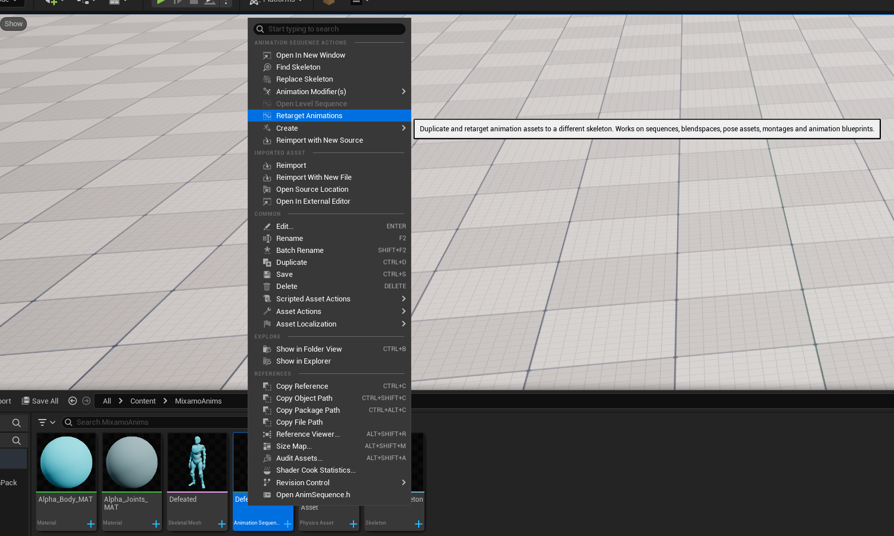

    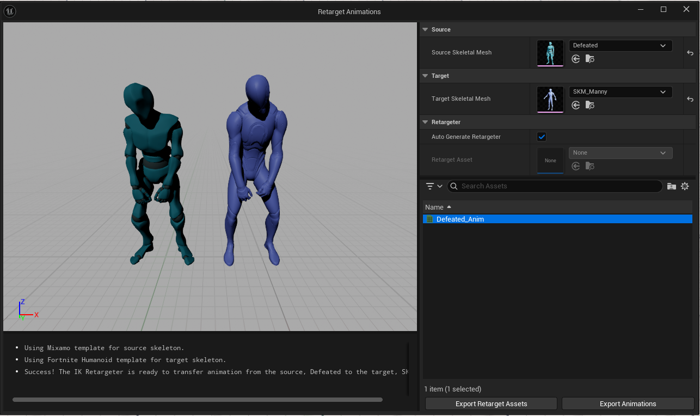

---

## 6. Using Packaged Custom Animations In Worlds

### 1. By Lua

For this example use case, we will try to load our packaged custom animation sequence asset and play it on player character with a Lua script.

1. After creating your workspace, open build mode and import the package you created in **Creator Kit HELIX Packaging Tool**. To do that, click **File** -> **Load Package** from top bar, navigate to your package folder cooked by Creator Kit, and select `configFile.json` in the folder.

    

    

2. After import is completed, you will get a panel on the left side of window with the package's name. It might appear empty if your package doesn't have any world placeable assets, which is not a problem.

    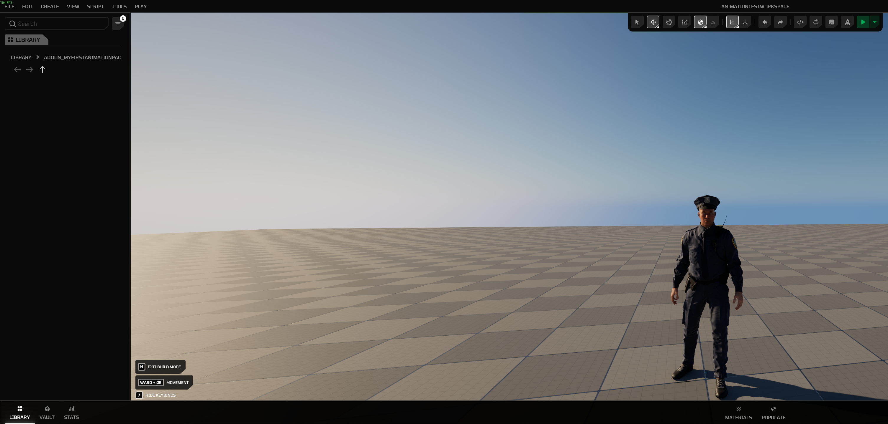

3. Now we need to write our Lua script to access the assets inside this package. Click **Edit Scripts** button and open your workspace folder.

    

    

4. To play an animation with [Animation API](../api/apiImport/classes/animation.md) after a player is spawned, add the server lua script below into  `WORKSPACE_ID/scripts/main/server/main.lua` path in your workspace. If the file doesn't exist, create it.

    ```lua
    -- Register a function to listen for player joined global event
    RegisterServerEvent('HEvent:PlayerReady', function(source)
        local AnimParams = UE.FHelixPlayAnimParams()
        Timer.Delay(HWorld, 2, function()
            local MyCharacter = GetPlayerPawn(source)
            -- Our custom package is named "Addon_MyFirstAnimationPack", and animation sequence asset inside is named "AS_Crying"
            local result = Animation.Play(MyCharacter, '/Game/Addon_MyFirstAnimationPack/AS_Crying.AS_Crying', AnimParams, function() print('Animation Ended') end)
            print('Animation play result: ', result)
        end)
    end)
    ```

4. Click the **Reload** button and then the **Play** button respectively to re-execute your lua scripts in workspace and then get back into play mode.

    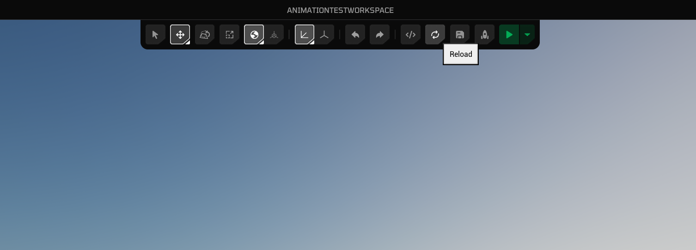

    

5. Observe your character plays the custom animation after a second.

    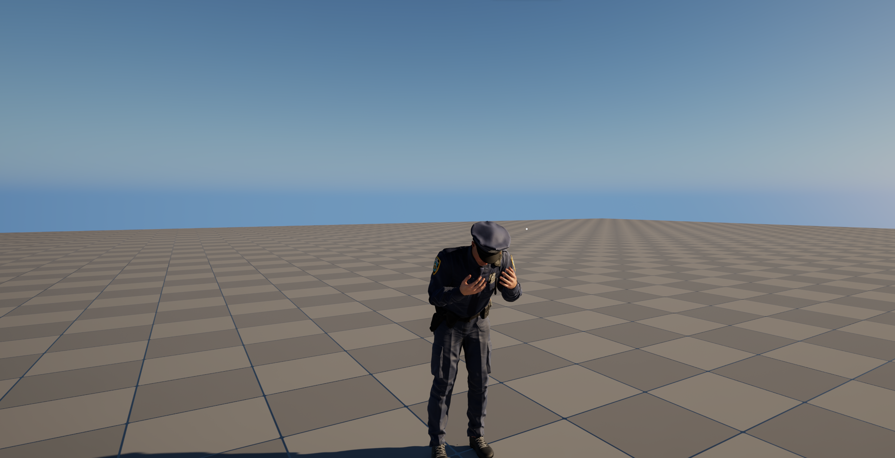

---

### 2. By Blueprint

[examples coming soon]

