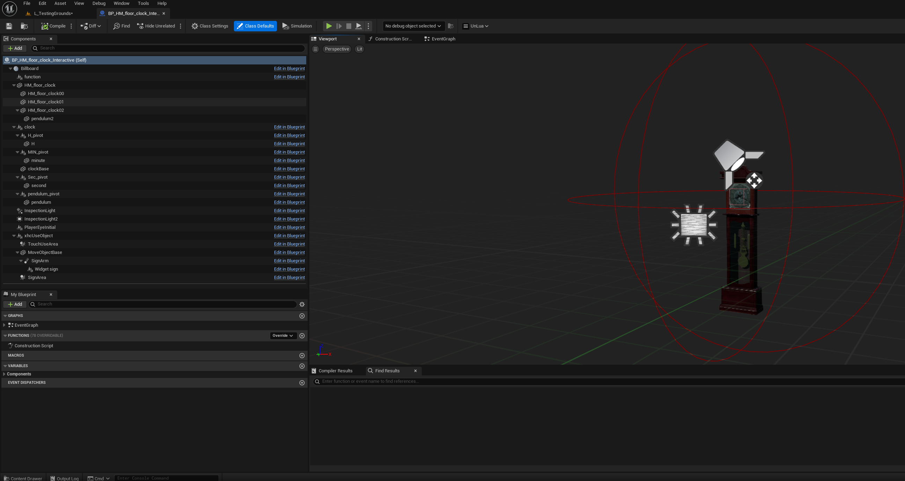
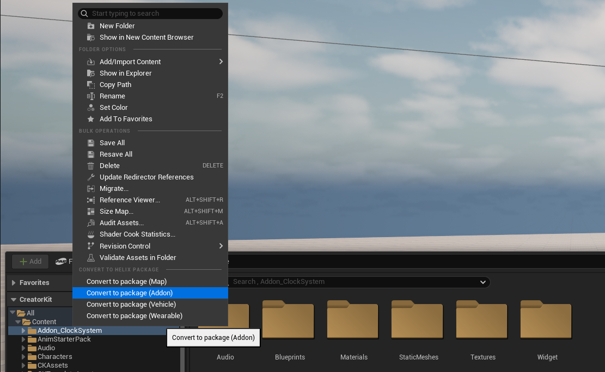
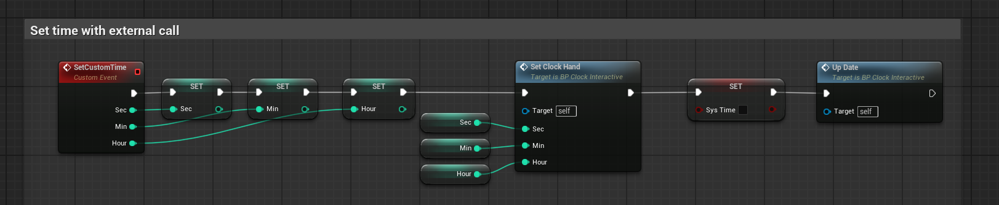
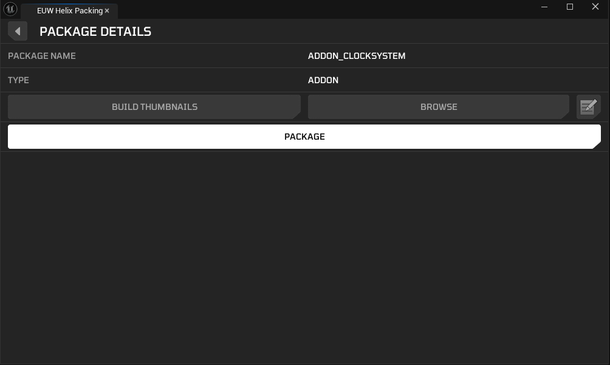
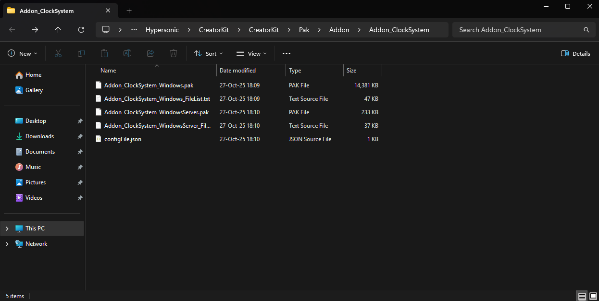
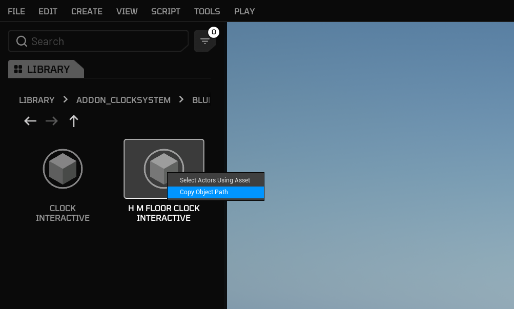
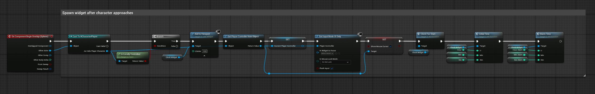

# Custom Blueprints

This guide walks you through the process of packaging blueprint assets as an Addon for the [Creator Hub](creatorhub.md) using the [Creator Kit](creatorkit.md).

If you're new to Unreal Blueprints, you can check out this [tutorial](https://www.youtube.com/watch?v=Xw9QEMFInYU) for an introduction to how they work.

## 1. Preparing Blueprint Assets To Package

First, you need to get the blueprint assets you would like to package into **Creator Kit**. Packaging blueprints is technically not different than packaging any type of Addon `.pak` file.

For this tutorial, we have a blueprint based clock system pack, which has a main clock actor blueprint, materials, textures, widgets, and sound files.



1. Launch the **Creator Kit** editor.

2. Find your imported Fab asset folder and right click to it. Select **Convert to Package (Addon)**. This will make it possible to directly cook this folder with HELIX Packaging Tool.

    

    /// info | Note
    Alternatively, you can also create a new package from HELIX Packaging Tool and move your assets or import source files into this created package folder.

    
    ///

---

## 2. Finalizing and Cooking The Package

1. Make sure all the depending assets by your blueprint are placed inside package folder. If one of those assets are placed outside of the created package folder, created .pak file will have missing dependencies and this might cause crashes or runtime errors during playthrough with this package.

    
  
    
  
    

2. Make sure you have defined all the required functions, events, variables etc. in your blueprints to later access them with Lua inside Helix after importing your package there.

    

4. Return to the HELIX Packaging Tool window.

5. With your package selected, click the **Package** button. This process will cook your assets into the final `.pak` file format required by the **Creator Hub**. This may take some time.

    

6. Once cooking is complete, a file explorer window will automatically open, displaying your final `.pak` files. Your blueprint addon pack is now ready to be uploaded to the **Creator Hub**!

    

---

## 3. Using Packaged Custom Blueprints In Worlds

### 1. By Lua

For this example use case, we will try to load our packaged custom blueprint asset and spawn it on world with a Lua script. Then, we will define a custom event in the actor blueprint and call it from Lua script.

1. After creating your workspace, open build mode and import the package you created in **Creator Kit HELIX Packaging Tool**. To do that, click **File** -> **Load Package** from top bar, navigate to your package folder cooked by Creator Kit, and select `configFile.json` in the folder.

    

    

2. After import is completed, you will get a panel on the left side of window with the package's name. It should show your package's content as shown below:

    

3. Find and right click to the blueprint you would like to spawn in world. Select **Copy Object Path** from the dropdown menu. You can use this full path in Lua scripts to load the object into memory.

    

4. Now we need to write our Lua script to spawn our blueprint actor. Click **Edit Scripts** button and open the workspace folder.

    

    

5. To spawn our blueprint actor locally in the client, we add the client lua script below into `WORKSPACE_ID/scripts/main/client/main.lua` path in the workspace.

    ```lua
    -- Load clock actor class from package. The path is copied from build mode interface as explained in the 3rd step.
    local ClockActorClass = UE.UObject.Load('/Game/Addon_ClockSystem/Blueprints/BP_HM_floor_clock_Interactive.BP_HM_floor_clock_Interactive_C')

    -- Spawn transform
    local SpawnTransform = Transform()
    SpawnTransform.Translation = Vector(500, 0, 150)
    SpawnTransform.Rotation = Rotator(0, 90, 0):ToQuat()
    SpawnTransform.Scale3D = Vector(1.5, 1.5, 1.5)

    -- Constructor
    local ClockActor = HWorld:SpawnActor(
        ClockActorClass,
        SpawnTransform,
        UE.ESpawnActorCollisionHandlingMethod.AlwaysSpawn
    )
    ```

    

6. We have a basic logic in the blueprint to spawn an UMG widget on screen as shown below. After walking towards the clock, the widget automatically spawns on the screen to tweak the time.

    

    

7. After walking towards the clock, the widget becomes accessible.

    <div style="position: relative; padding-bottom: 56.25%; height: 0; overflow: hidden;">
      <iframe src="https://youtube.com/embed/O9OXYgnxmpo?si=ueKFLQS0FXjRbz-X"
              style="position: absolute; top: 0; left: 0; width: 100%; height: 100%;"
              frameborder="0"
              allowfullscreen>
      </iframe>
    </div>

8. Now let's call an event we've previously defined in the blueprint. Our `SetCustomTime` event changes the time shown on the clock.

    

9. After restarting the game to clean the level from previous changes, we add the function call below at end of our `main.lua` script to execute our custom event on spawned blueprint actor. The same syntax can be used for calling any function in spawned actors.

    ```lua
    -- Manually set time on spawned clock with our blueprint defined event
    ClockActor:SetCustomTime(0,30,5) -- second, minute, hour
    ```

---

### 2. By Blueprint

[examples coming soon]
