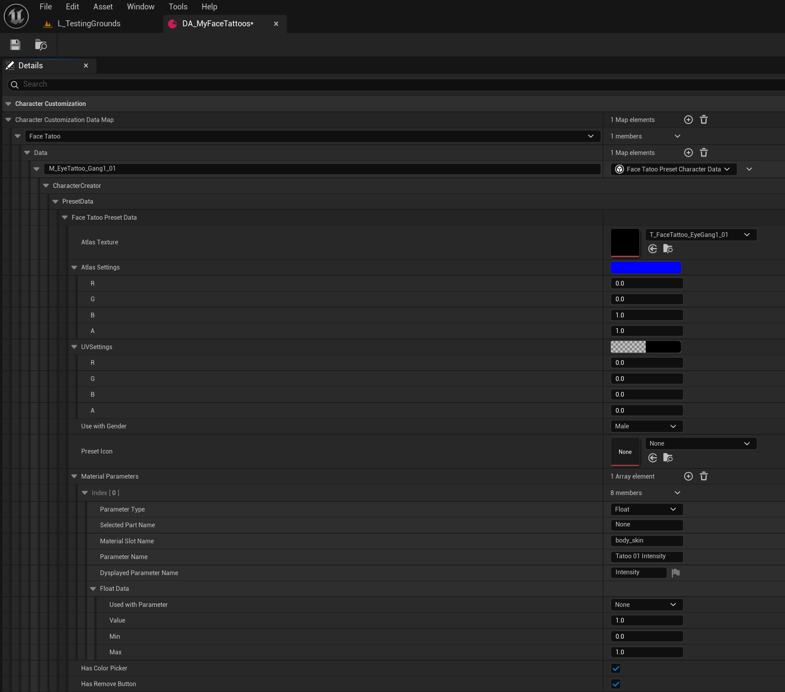

# Face Tattoo

This guide walks you through the process of creating and packaging Face Tattoos for the [Creator Hub](creatorhub.md) using the [Creator Kit](creatorkit.md).

    <iframe src="https://youtube.com/embed/BgX7PzguWWI?si=RNOkwJNMAGAxdQU_" style="position: absolute; top: 0; left: 0; width: 100%; height: 100%;" frameborder="0" allowfullscreen> </iframe>

## 1. Acquire Your Required Template Resources

/// warning | Notice
We have supplied Template assets inside of Creator Kit to make custom asset development easier. This can currently be found in **Content/CKTemplateAssets**
///

For this tutorial we will need T_HeadTextureTemplate_Male for visual guidance.

1. Launch the **Creator Kit** editor.

2. Navigate to **CKTemplateAssets** in the Content Browser.

3. Search for **T_HeadTextureTemplate_Male**, or look in the appropriate folders (e.g. **CKTemplateAssets/Textures**).

4. Right Click the texture and select **Asset Action > Export**.

---

## 2. Image Editing

After acquiring the template asset we need to put them to use in an image editor such as **Photoshop**. I recommend **Photopea** as a free, accessible option

1. Launch your image editor **e.g. Photopea**.

2. Open the downloaded head texture.

3. Create a new layer above it.

4. Add/ create your Tattoo design in the above layer.

5. Hide the background layer/ face texture (depending on software and opening type - The Background Layer may need to be unlocked)

6. Export as a .png (keep the resolution low where possible e.g. 512x512 or 1024x1024)

---

## 3. Creator Kit Package setup

1. Launch the **Creator Kit** editor.

2. Access the **HELIX Packaging Tool** from the main toolbar.

3. In the packaging tool window, click **New Package**.

4. Enter a unique Package Name (e.g., MyNewWearable).

5. Select **Wearable** as the **Package Type**.

    

6. Click **Add New Package**. This action creates a dedicated plugin folder for your assets (e.g., **Plugins/Wearable_MyNewWearable**).

    

7. Go into the folder you've created and click **Import** button in content browser. Choose your `.png` texture file

8. Make sure the texture is not a Virtual texture (VT) - If it is, convert it to a regular texture by right clicking and selecting convert VT to regular texture.

---

## 4. Data Asset Initial Setup

1. In your created package folder, right click and search **Data Asset**.

2. Select **Data Asset** and set **Character Customization Data Asset** as the class

3. Rename your new data asset (e.g. MyNewFaceTattoos)

4. Open your new Data Asset.

5. Press (**+**) to add a new wearable type.

6. Change **Full Character Presets** to the type of wearable you want to add (e.g. **Face tatoo**)

7. Expand this new array element and press (**+**) next to **Data** to add a new wearable of the above mentioned type.

8. Rename your new wearable appropriately (e.g. **M_Eye_FaceTattoo_01** - M denoting Male)

---

## 5. Face Tattoo (Non Atlas texture) Data Setup

1. Set Atlas texture to your imported Body tattoo texture.

2. For non atlas textures set Atlas Settings to (R=0,G=0,B=1,A=1)

3. Keep uv setting at  (R=0,G=0,B=0,A=0)

4. Select what Gender your tattoo is for/ compatible with (e.g. Male)

5. Set a Pre-set Icon if you have one (Please create and assign a 512x512 // 256x256 icon before uploading to Vault)

6. We’d recommend enabling both “Has Color Picker” and “Has Remove Button”

7. Under Material Parameters see ***HERE***  for options

     The most important variable that you add and set is Intensity _(the rest are optional)_

        Type: Float
        Selected part name: None
        Material Slot Name: body_skin
        Parameter Name: Tatoo 01 Intensity
        Display Parameter name: Intensity
        Used with perameter: None
        Value: 1 (This is important. This is the opacity of your tattoo)
        Min: 0
        Max: 1

    

9. Once you’re done, Save your data table and all assets you’ve added to you package folder.

---

## 6. Packing

1. Return to the HELIX Packaging Tool window.

2. With your package selected, click the **Package** button. This process will cook your assets into the final `.pak` file format required by the HELIX Creator Hub. This may take some time.

    

3. Once cooking is complete, a file explorer window will automatically open, displaying your final `.pak` files. Your wearable is now ready to be uploaded to the **Creator Hub**!

    

   ---

## 7. Testing your Wearable

### 1. In Creator Kit

1. This method doesn't require you to cook the package on the previous steps. As long as you placed all the required assets in your package folder in Creator Kit, and created the data asset as explained, it automatically becomes available for editor playthroughs

2. Press play in **Creator Kit** editor, and press **P** button to show the **Character Customization UI** for your character.(e.g. Face > Tattoos)

3. In the shown UI, you should be able to navigate to your new clothing and click on it to test on the character. (e.g. Face > Tattoos)

### 2. In HELIX

1. Create a draft world and import the `.pak` file you've cooked in **Creator Kit**.

    

    

2. If import was successful, you should see your assets in the left panel.

3. Importing also makes your wearables automatically available in **Character Customization UI**. Go back to the game from build mode, and press **P** button.

4. Your imported clothing should be available in the corresponding category.

---

## 8. Ready To Rock
Once you've followed these steps, uploaded your package to Creator Hub, and imported it into your world, your new wearable items will be available for players joining your public world!

