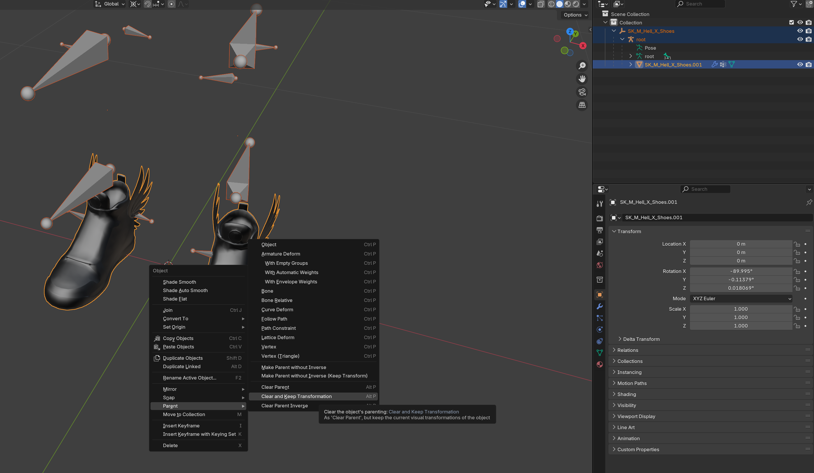
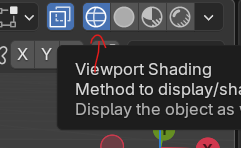
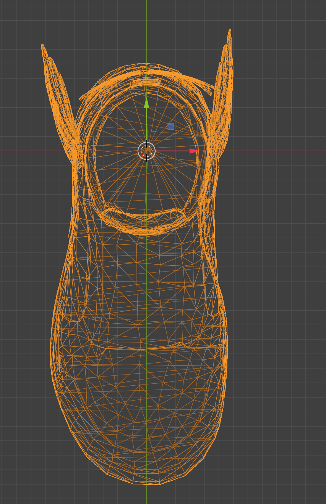
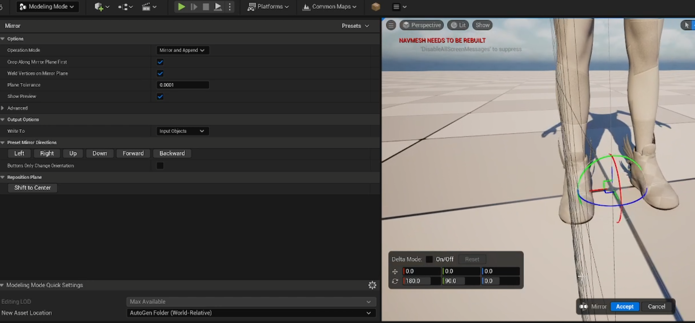
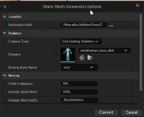
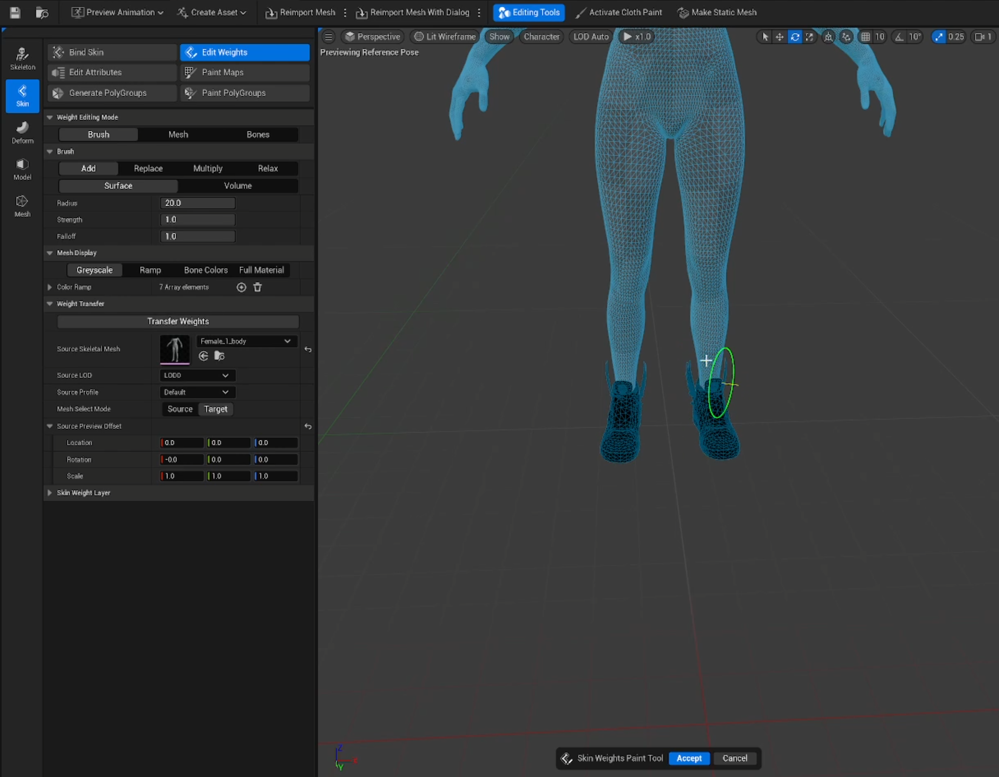
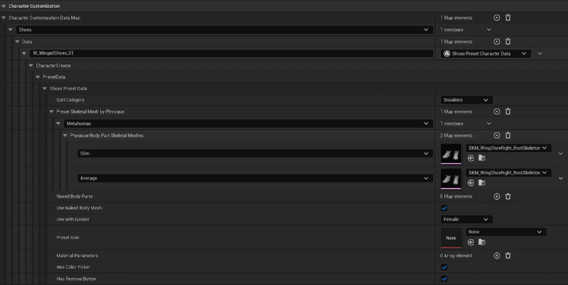

# Custom Shoes

This guide walks you through the process of creating and packaging Custom Shoes using the [Creator Kit](https://github.com/Hyper-Ross/helix-documentation/blob/Ross_CC_Tattoos/docs/tutorials/creatorkit.md).

Before you start, have your shoe model created and ready. It’ll be easier to start with one shoe and mirror it after placement. If you have shoes for both feet I’d suggest deleting one and keeping the other or you’ll likely need to do your mesh placement in a 3d modelling package. Follow Shoe Mesh prepeartion to make sure your can follow the tutorial closer.

If you're creating open foot shoes, e.g. sandals and flip flops, step "**3. Shoe Setup**" will look different for you. You'll need to export the body template mesh, import it into you modelling package and adjust the mesh to fit exactly. You may need to be more methodical with your custom weight painting too.

---

## **1. Shoe Mesh Preparation**

For the purpose of this tutorial I’ll be using one shoe and mirroring it in unreal. If you’d like to follow along with me exactly and you have both shoes and it’s already bound to a skeleton, follow these steps.

1. Launch your modelling package **e.g. Blender**.
2. Import/ create your shoes.

### If you’re importing shoes that are already bound to a skeleton follow these steps:

1. In the object outliner, Open up the skeleton root until you get to your mesh.
2. Select your mesh
3. Right click the object in the viewport OR press Alt+P
4. Select Parent > Clear and Keep Transformation 

    

1. Then delete all objects and bones other than your one shoe mesh

### If your shoe mesh is combined and contains both feet:

1. Enter edit mode by pressing TAB 
2. Enter wireframe mode 

    

1. Drag select one of the shoes so it’s highlighted orange
2. Press the Delete key
3. Then select Faces
4. Press TAB again to exit edit mode
5. Now using the move gizmo align you remaining shoe so the heel area is aligned with the world origin
6. Also rotate your shoe on the z axis if it’s not straight

    

After making the required adjustments, export your shoe model out as a `.fbx`.

---

## **2. Creator Kit Package setup**

1. Launch the **Creator Kit** editor.
2. Access the **HELIX Packaging Tool** from the main toolbar.
3. In the packaging tool window, click **New Package**.
4. Enter a unique Package Name (e.g. **MyNewShoes01**).
5. Select **Wearable** as the **Package Type**.
    
    
    
6. Click **Add New Package**. This action creates a dedicated plugin folder for your assets (e.g., **Plugins/Wearable_MyNewShoes01**).
    
    
    
7. Go into the folder you've created and click the **Import** button in content browser. Choose your `.fbx` shoe model file. (You can also drag it into the Content Browser from Windows File Explorer)
8. Do the same import procedure for any and all textures

---

## **3. Shoe Setup**

Please note, shoes are not cross compatible between genders, you will have to do these steps for male and female separately.

1. Find the Male and Female body template inside of **CKTemplateAssets/CharacterCreator/SkeletalMeshes**
2. Drag the appropriate mesh into the scene. The male mesh if you’re creating shoes for a male or the female skeletal mesh if your shoes are for a female.
3. Set the skeletal mesh’s Location, Scale and rotation back to default by pressing the back arrow or set Location: 0,0,0 Rotation; 0,0,0 Scale: 1,1,1
4. Then add your shoe mesh into the scene.
5. Now align your shoe mesh to the correct foot. 
6. Then enter modelling mode by using the drop down or press Shift+6
7. With you shoe selected, press the Model tab and select Mirror.
8. Set the Preset Mirror direction to Forward and set the transform location to 0,0,0
9. If your shoe has mirrored correctly to the other foot, press Accept

    

1. Now got to **xForm** and Press **Edit Pivot**.
2. Set the Box Positions to World Origin and hit **Accept**.
3. Then in the **xForm** tab, select Bake Transform and **Accept**.
4. Now save your shoes mesh.

---

## **4. Convert Static Mesh to Skeletal Mesh**

1. Right Click the shoes mesh and select **Convert to Skeletal Mesh**.
2. Make sure the desired path is your pack content folder (e.g. **/Wearable_MyNewShoes01**).
3. Set Creation Type to **Use Existing Skeleton.**
4. In the Skeleton box assign the Skeleton “**metahuman_base_skel**”.
5. Set **Binding Bone Name** to root.
6. Set **Prefix to Remove** to **SM_.**
7. Set **Skeletal Mesh Prefix** to **SKM_.**
8. Press **Convert.**

    

1. Save the newly created skeletal mesh.
2. You can now delete the Static Mesh from the project as we wont need it.

---

## **5. Skeletal Mesh Setup**

1. Open your shoes skeletal mesh.
2. Create and apply your shoe material
3. Enable the Editing Tools
4. Press the skin tab and select Edit Weights
5. Under Weight Transfer, assign the male or female body you used as a placement guide to the Source Skeletal Mesh input.
6. Make sure the LOD is set to LOD0, Source profile is Default Mesh select mode is Target, Location is 0,0,0 and hit Transfer Weights.
7. Then press **Accept**.

    

---

## **6. Data Asset Initial Setup**

1. In your created package folder, right click and search **Data Asset**.
2. Select **Data Asset** and set **Character Customization Data Asset** as the class.
3. Rename your new data asset (e.g. DA_MyShoeCollection01)
4. Open your new Data Asset.
5. Press (**+**) to add a new wearable type.
6. Change **Full Character Presets** to the type of wearable you want to add (e.g. **Shoes**)
7. Expand this new array element and press (**+**) next to **Data** to add a new wearable of the above mentioned type.
8. Rename your new wearable appropriately (e.g. **F_WingedShoes_01** - F denoting Female)

---

## **7. Shoes Data Setup**

1. Set **Sort Category** to the type of shoes you’re adding (e.g. Sneakers).
2. Under the Preset Skeletal Mesh by Physique array, add a new element by pressing (+).
3. Under the new **Metahuman** physique type, press (+) twice on the **Physique Body Part Skeletal Meshes** array.
4. Assign your shoe’s skeletal mesh to both the **Slim** and **Average** input.
5. Assign the correct Gender for your shoes.
6. Set a Pre-set Icon if you have one (Please create and assign a 512x512 // 256x256 icon before uploading to Vault)
7. We’d recommend enabling both “Has Color Picker” and “Has Remove Button”
8. The material parameters can be left blank for now as this will depend on your material setup.

    

---

## **8. Packing**

1. Return to the HELIX Packaging Tool window.
2. With your package selected, click the **Package** button. This process will cook your assets into the final `.pak` file format required by the HELIX Creator Hub. This may take some time.
    
    
    
3. Once cooking is complete, a file explorer window will automatically open, displaying your final `.pak` files. Your wearable is now ready to be uploaded to the **Creator Hub**!
    
    
    
    ---
    

## **9. Testing your Wearable**

### **1. In Creator Kit**

1. This method doesn't require you to cook the package on the previous steps. As long as you placed all the required assets in your package folder in Creator Kit, and created the data asset as explained, it automatically becomes available for editor playthroughs.
2. Press play in the **Creator Kit** editor, and press the **P** key to show the **Character Customization UI** for your character.
3. In the shown UI, you should be able to navigate to your new wearable and click on it to test it on the character. (e.g. Outfits > Shoes)

### **2. In HELIX**

1. Create a draft world and import the `.pak` file you've cooked in **Creator Kit**.
    
    
    
    
    
2. If import was successful, you should see your assets in the left panel.
3. Importing also makes your wearables automatically available in **Character Customization UI**. Go back to the game from build mode, and the press **P** key.
4. Your imported wearable should be available in the corresponding category.

---

## **10. Ready To Rock**

Once you've followed these steps, uploaded your package to Creator Hub, and imported it into your world, your new wearable items will be available for players joining your public world!
