# Custom Wearables

This guide walks you through the process of packaging wearable clothing assets for the [Creator Hub](creatorhub.md) using the [Creator Kit](creatorkit.md).

## 1. Creating Your Wearable Clothing Asset

You can use the resources available on [Google Drive](https://drive.google.com/drive/folders/1812fAmwFCqwf7hKeIHdj9c9_Ujc9FyLk?usp=drive_link) to create compatible clothing pieces for HELIX characters.

/// warning | Warning
HELIX characters use **Metahuman Rig** as cosmetic representation by default, and custom wearable support is only available for this cosmetic type.
///

/// note | Source Assets
If required, you can download metahuman [Male Body](https://drive.google.com/file/d/1yX3N7yHKZYzXyua2fEfmunT2jqY7zHXR/view?usp=drive_link), [Female Body](https://drive.google.com/file/d/1shIjTgwJfpWw9707R9PVmyCUWYfRns-6/view?usp=drive_link), and [Head](https://drive.google.com/file/d/1pCj4H_F1CCBJxtbo-1JQNwA4jo0X4ruW/view?usp=drive_link) skeletal mesh source files to use as reference on your work. We currently use **medium height** & **normal weight** variations for metahumans as base.
///

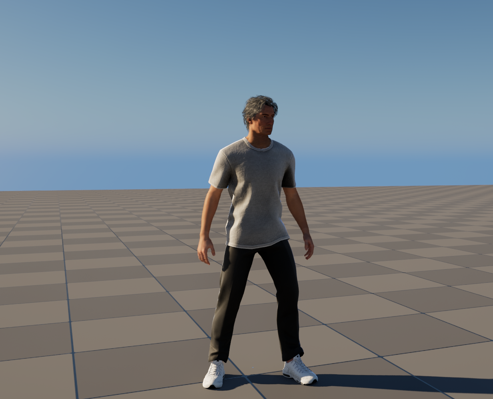

---

## 2. Preparing Your Wearable Clothing Package

After acquiring an `.fbx` file for the clothing piece you created in the previous step, we need to import it into **Creator Kit**.

For this tutorial, we will be importing a simple cap accessory for our character.

1. Launch the **Creator Kit** editor.

2. Access the **HELIX Packaging Tool** from the main toolbar.

3. In the packaging tool window, click **New Package**.

4. Enter a unique Package Name (e.g., MyNewWearable).

5. Select **Wearable** as the **Package Type**.

    

6. Click **Add New Package**. This action creates a dedicated plugin folder for your assets (e.g., **Plugins/Wearable_MyNewWearable**).

    

7. Go into the folder you've created and click **Import** button in content browser. Choose your `.fbx` file

    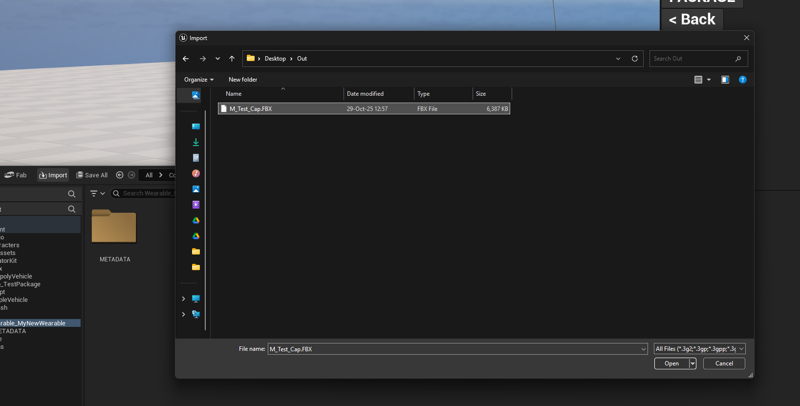

8. On the next window, find **Skeleton** field and choose **SK_Unified** from the list. This ensures your mesh is encoded with the project's main skeleton asset, making it compatible with character customization system.

    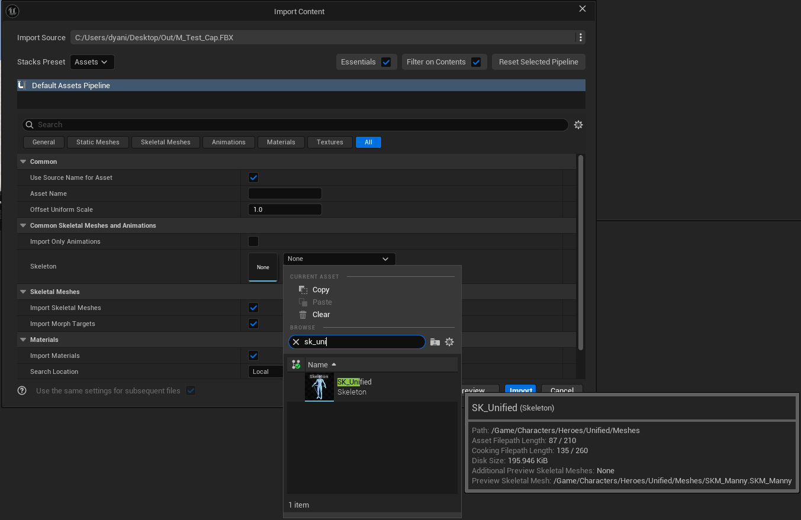

9. After clicking import, you should observe a mesh, a physics asset and a material created in your folder.

    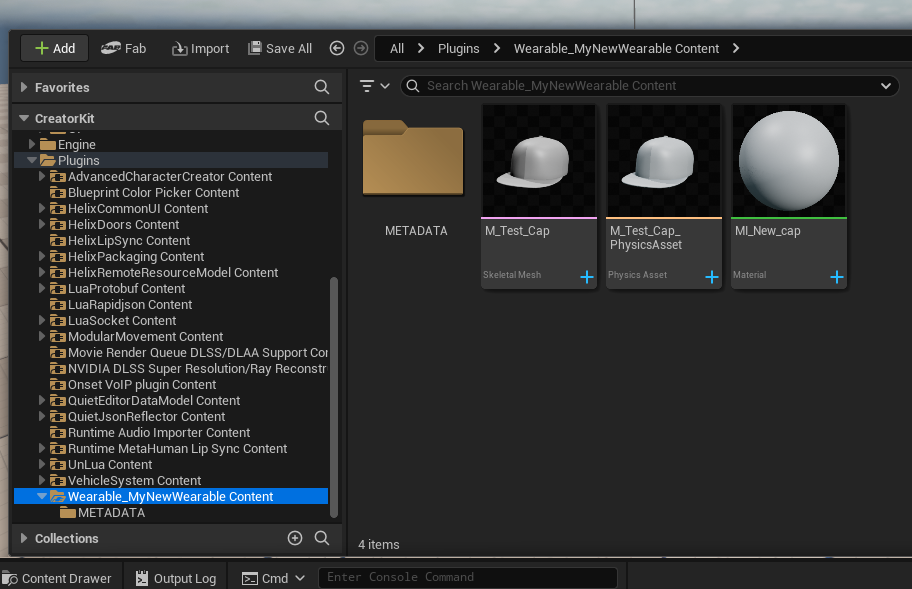

10. Optionally, you can also import additional textures and a thumbnail image for your clothing in the same folder.

---

## 3. Tweaking Your Wearable Clothing

1. Open the automatically created physics asset and ensure the capsule covers the mesh approximately. This is required for your mesh bounds are properly calculated for FOV based occlusion. If this is not done properly, you mesh can disappear randomly from certain camera angles during gameplay. Please check [Physics Asset Editor Documentation](https://dev.epicgames.com/documentation/en-us/unreal-engine/physics-asset-editor-in-unreal-engine) for more information.

    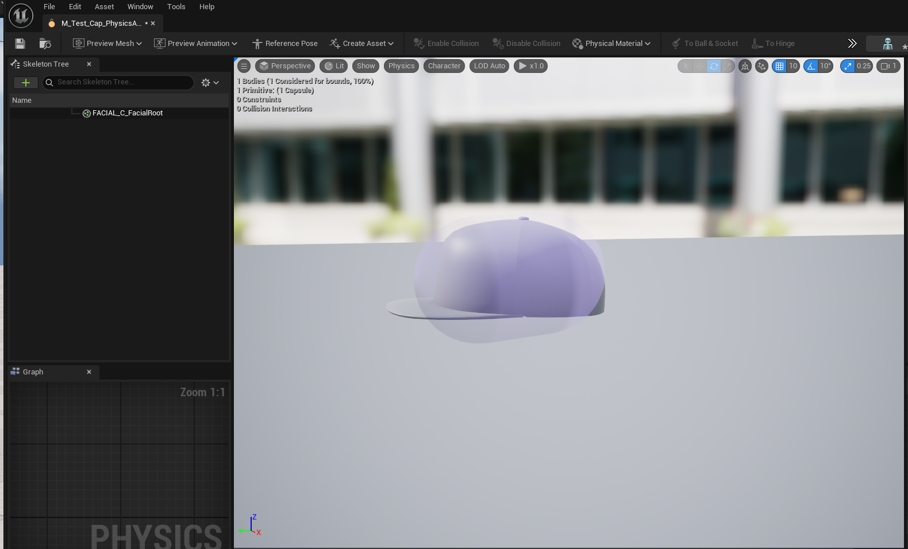

2. Next, open your skeletal mesh asset. Tweak any required parameters, and ensure you have LOD data generated for your mesh. This ensures your mesh does not negatively impact performance for distant characters wearing your clothing. You can set LOD count to 8 and click regenerate to automatically generate LODs for your mesh, as shown below.

    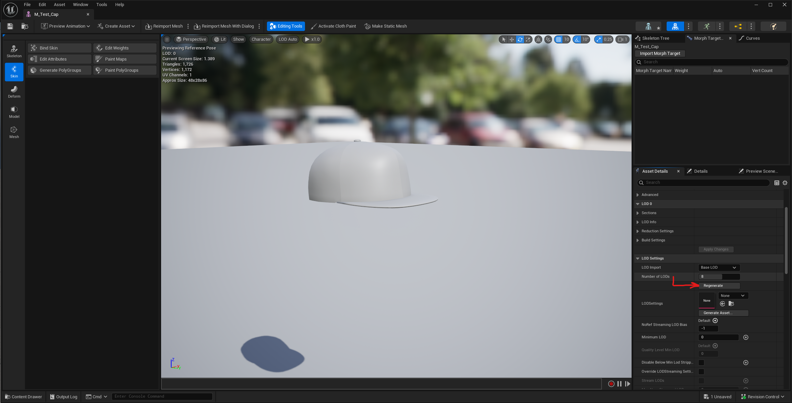

3. Finally, you can open your material and tweak it as you like. If there are extra textures required for your clothing, you can import them into same package folder and reference in your material.

    /// info | Note
    Material parameter binding into Character Customization UI is currently in progress and will be documented soon. This will allow you to customize color or other properties of your clothing from the character customization UI within game.
    ///

---

## 4. Finalizing and Cooking The Package

1. Make sure all the depending assets by your wearable clothing are placed inside package folder. If one of those assets are placed outside of the created package folder, created `.pak` file will have missing dependencies and this might cause crashes or runtime errors during playthrough with this package.

2. Right click to an empty space in your package folder, and choose **Miscellaneous** -> **Data Asset**.

    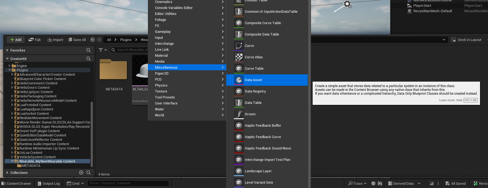

3. Choose **Character Customization Data Asset** from the new window. This data asset is responsible for categorizing your clothing and storing the required parameters.

    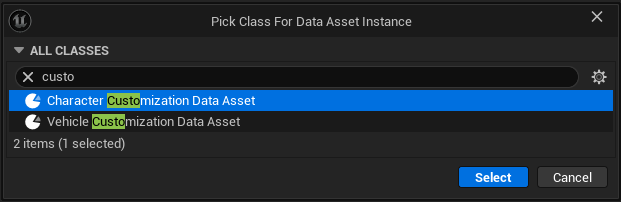

4. Give it a meaningful name, something like `DA_MyNewWearable` and open. Click **+** button and choose the correct category for your wearable. For this tutorial, we'll choose **Hats**.

5. Create 2 new sub-entries inside your new entry, and give them meaningful names. Each entry will represent a gender specific version of your wearable. If you're adding a basic clothing piece as hats like our example, you can use same mesh for both entries as shown below:

    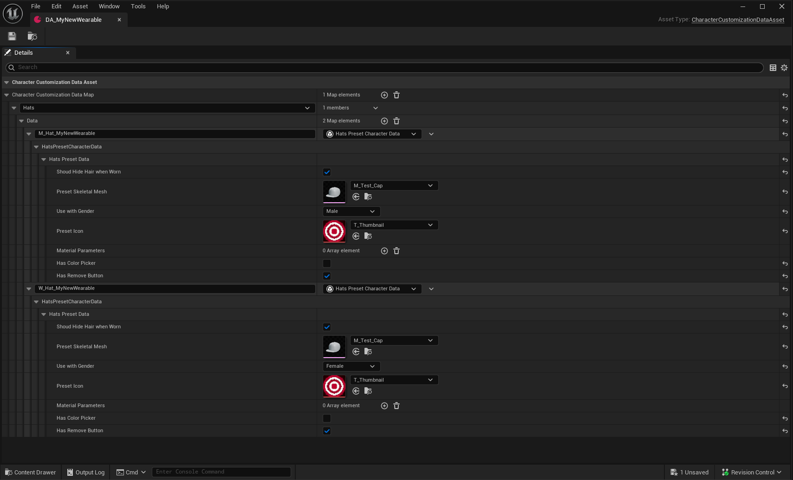

6. Ensure available parameters for your clothing type are set properly before finalizing.

7. Return to the HELIX Packaging Tool window.

8. With your package selected, click the **Package** button. This process will cook your assets into the final `.pak` file format required by the HELIX Creator Hub. This may take some time.

    

9. Once cooking is complete, a file explorer window will automatically open, displaying your final `.pak` files. Your wearable is now ready to be uploaded to the **Creator Hub**!

    

---

## 5. Testing Your Clothing

### 1. In Creator Kit

1. This method doesn't require you to cook the package on the previous steps. As long as you placed all the required assets in your package folder in Creator Kit, and created the data asset as explained, it automatically becomes available for editor playthroughs.

2. Press play in **Creator Kit** editor, and press **P** button to show the **Character Customization UI** for your character.

3. In the shown UI, you should be able to navigate to your new clothing and click on it to test on the character.

    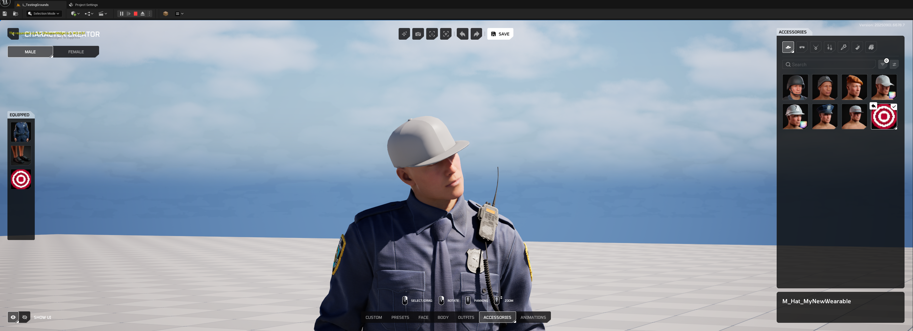

### 2. In HELIX

1. Create a draft world and import the `.pak` file you've cooked in **Creator Kit**.

    

    

2. If import was successful, you should see your clothing asset on left panel.

    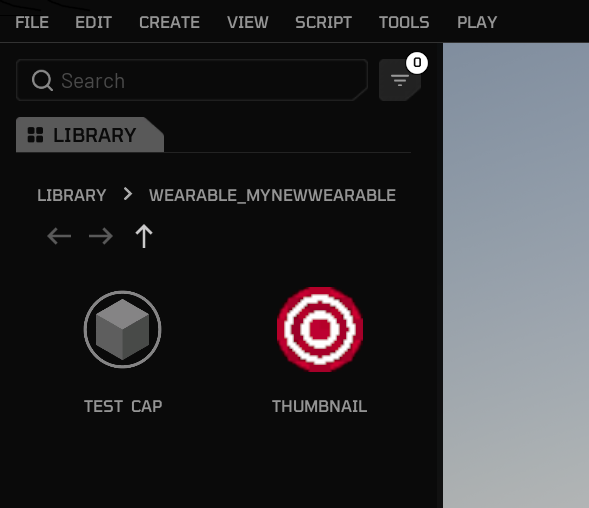

3. Importing also makes your clothing automatically available in **Character Customization UI**. Go back to the game from build mode, and press **P** button.

4. Your imported clothing should be available in the corresponding category.

    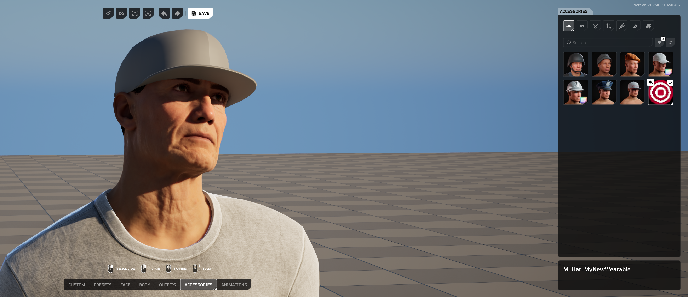

---

## 6. On Your Own

Once you've followed these steps, uploaded your package to **Creator Hub**, and imported it into your world, your new clothing piece will be available for players joining your public world!
